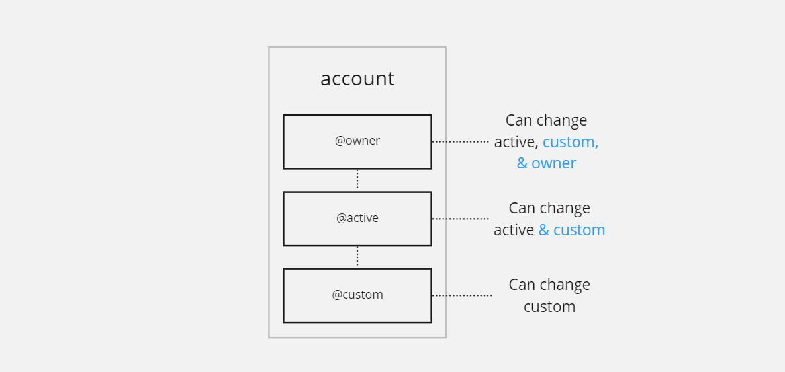
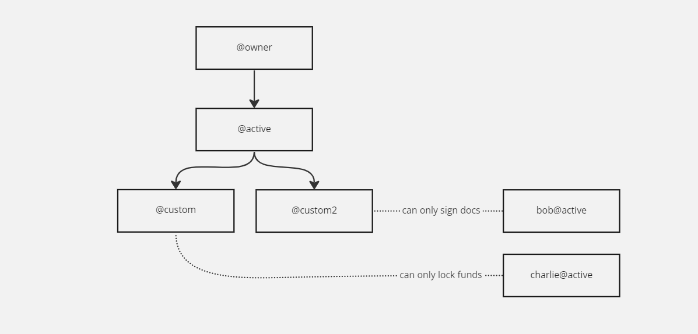
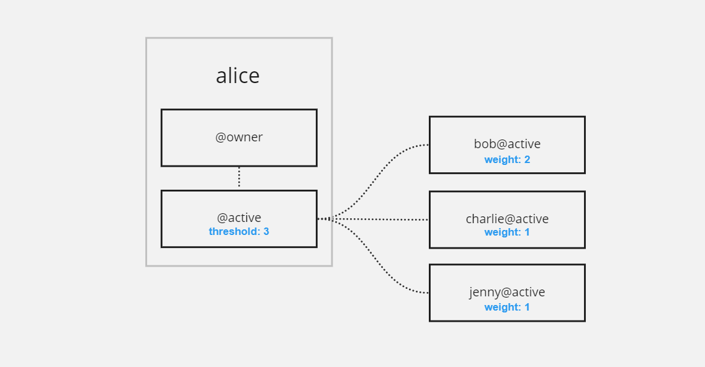

EOS 네트워크의 계정은 계정이 소유한 EOS 토큰, 처분할 수 있는 리소스, 계정 제어 권한 구조 및 이 가이드의 뒷부분에서 다룰 기타 다양한 정보와 같은 다양한 정보를 보유하는 디지털 컨테이너입니다. 계정은 또한 스마트 계약을 보유할 수 있습니다.

계정은 트랜잭션을 실행할 뿐만 아니라 블록체인 데이터에 액세스하고 제어할 수 있게 해주는 핵심 구성 요소입니다.


## 계정 이름

EOS 네트워크의 모든 계정에는 사람이 읽을 수 있는 이름이 있습니다. 이를 통해 거래 수신자와 스마트 계약을 쉽게 식별할 수 있습니다. 블록체인에서 계정 이름을 효율적으로 유지하기 위해 모든 이름에 몇 가지 제한 사항이 적용됩니다.


* 모든 문자는 소문자여야 합니다.
* 모든 이름은 12자(접미사/프리미엄 이름 포함)이어야 합니다.
* 글자만 `a-z`, 숫자 `1-5`, 및 마침표(`.`)은 지원되는 문자입니다.
* 이름은 숫자나 마침표로 시작할 수 없습니다.
* 이름은 마침표로 끝날 수 없습니다.

기간은 EOS 계정에 특별한 의미가 있습니다. 그들은 계정에 **프리미엄 이름**이라고도 하는 **접미사**(.com과 같은 최상위 도메인과 유사)가 있음을 지정합니다. 접미사가 있는 계정은 **접미사 소유자**만 만들 수 있습니다.

예를 들어 누군가가 접미사를 소유하고 있는 경우 `.bar` 그러면 그 사람만 만들 수 있습니다. `foo.bar`.

이 가이드의 끝에서 우리는 EOS 네트워크의 누군가가 프리미엄 이름을 구매할 수 있도록 하는 이름 입찰 시스템에 대해 이야기할 것입니다.


## 공개/개인 키

모든 EOS 계정은 궁극적으로 공개/개인 키 쌍에 의해 제어됩니다. 개인 키는 트랜잭션 서명에 사용되며 기밀로 유지되어야 하며 공개 키는 블록체인에서 계정을 식별하는 데 사용되며 공개적으로 알려질 수 있습니다.

계정의 디지털 자산을 완벽하게 제어할 수 있으므로 개인 키를 보호하는 것이 중요합니다. 개인 키는 안전한 소프트웨어 또는 하드웨어 지갑에 저장해야 합니다. 이를 소유한 사람은 누구나 계정에 연결된 자산에 대한 전체 액세스 권한을 갖기 때문입니다.

EOS 계정은 *권한 시스템*이라는 것을 사용하여 기본적으로 추가 보안 메커니즘을 제공합니다.

개인 및 공개 키의 예:
```Private: 5KSdyAiFzYQAtBKDBKCCF28KMMhZ4EmXUxSg8B3nSkHKutT15rY
Public: PUB_K1_5d7eRKgCCiEdsbBdxxnZdFWnGYS64uWZPZgTcTU1xnB2aESxqR
Legacy Public Format: EOS5d7eRKgCCiEdsbBdxxnZdFWnGYS64uWZPZgTcTU1xnB2cq4JMD
```


## 권한 시스템

각 계정에는 해당 계정이 수행할 수 있는 작업을 제어하는 ​​계층적 권한 집합이 있으며 기본적으로 두 가지 기본 권한이 제공됩니다. 이 두 권한은 계정이 제대로 작동하는 데 필요하므로 제거할 수 없습니다.

필수 권한은 `owner` 그리고 `active`.

권한은 자신을 제어하는 ​​항목(키 또는 계정) 또는 하위 항목을 제어하는 ​​항목만 변경할 수 있습니다. 부모를 제어하는 ​​것은 절대 변경할 수 없습니다.




권한을 제어하는 ​​것은 공개 키(체인에 등록되고 연결된 개인 키에 의해 제어됨) 또는 다른 것입니다. `account@permission`. 이를 통해 여러 당사자가 자신의 계정 보안에 대한 완전한 자율성을 유지하면서 단일 계정을 제어하는 ​​복잡한 계정 제어 구조를 만들 수 있습니다.

다음 다이어그램을 예로 들어 계정이 `alice` 둘 다에 의해 제어됩니다. `bob` 그리고 `charlie`, 하는 동안 `charlie` 에 의해 제어되기도 합니다. `tom`. 결국 모든 계정은 키로 제어됩니다.


아래에 맞춤 권한을 추가할 수 있습니다. `active` 특정 계약의 작업(호출 가능한 기능)에만 해당 권한의 액세스를 제한할 수 있습니다. 그러면 해당 권한은 지정한 계약 작업과만 상호 작용할 수 있습니다.

즉, 계정 간에 세분화된 액세스 권한을 생성하고 계층적 소유권과 사용 권한을 가질 수 있습니다.





가장 중요한 것은 권한 시스템에 다중 서명 트랜잭션(여러 당사자가 서명해야 하는 트랜잭션)을 기본적으로 지원한다는 것입니다. 권한과 연결된 모든 연결된 계정 또는 키에는 **가중치**가 할당되어 있으며 권한 자체에는 **임계값**이 있습니다.

아래 예에서 볼 수 있듯이, `bob` 혼자서는 다음을 사용하여 서명할 충분한 권한이 없습니다. `active` 허가. 그는 둘 중 하나가 필요합니다 `charlie` 또는 `jenny` 모든 거래에 대해 그와 공동 서명 `alice@active` 만든다. 반면에, `charlie` 그리고 `jenny` 트랜잭션에 단독으로 서명할 수 없으므로 필요합니다. `bob`. 





## 스마트 계약

스마트 계약은 블록체인에서 실행되는 프로그램일 뿐입니다. Todo 애플리케이션과 같은 단순한 것부터 블록체인에서 실행되는 본격적인 RPG 게임에 이르기까지 계정에 기능을 추가할 수 있습니다.

모든 계정은 하나의 스마트 계약을 배포할 수 있지만 스마트 계약은 마음대로 업데이트하고 교체할 수 있습니다.

계정에 스마트 계약을 배포하는 방법에 대한 자세한 내용은 다음을 참조하십시오. [듄 가이드](./10_dune-guide.md).


## DUNE 계정 만들기

**DUNE**이 설정되면 단일 명령으로 로컬 개발 환경에서 계정 생성을 시작할 수 있습니다.

```shell
dune --create-account <ACCOUNT_NAME>
```

방금 생성한 계정과 관련된 정보를 보려면 다음 명령을 사용할 수 있습니다.

```shell
dune -- cleos get account <ACCOUNT_NAME>
```


## 디지털 자산의 소유권

계정이 소유할 수 있고 블록체인에 저장되는 데이터를 일반적으로 "디지털 자산"이라고 합니다. 이러한 디지털 자산의 **소유권**은 단순히 분산형 데이터베이스(블록체인)의 행에서 자산이 특정 계정에 속하며 해당 계정만이 해당 디지털 자산을 조작, 전송 또는 제어할 수 있음을 의미합니다. .

스마트 계약은 또한 해당 디지털 자산을 계정과 공동 소유하며 사용자의 명시적인 동의 없이 테이블 내부에 저장된 모든 자산을 조작할 수 있음을 명심하십시오.

스마트 계약 개발자는 마음대로 스마트 계약을 업데이트할 수 있으므로 보안 또는 재정적 영향이 있는 계약은 사용자 신뢰 증가를 위해 업그레이드 가능성을 교환하기 위해 스마트 계약 업데이트 기능을 포기할 수 있습니다.


## 계정 소유권 포기

업그레이드 가능성은 스마트 계약 개발에 상당한 이점이 있지만 항상 필요한 것은 아닙니다.

스마트 계약의 업그레이드 가능성을 포기하려면 두 가지 옵션이 있습니다.


### NULL 계정

계약 계정의 소유자 및 활성 권한을 다음으로 설정할 수 있습니다. `eosio.null@active`. 이것은 `NULL` 이러한 목적을 위해 특별히 설계된 계정입니다. 개인 키나 소유자가 없습니다.

이 계정에 대한 통제권을 **영원히** 포기하려는 경우 좋은 옵션입니다.


```dune -- cleos set account permission <ACCOUNT> active '{"threshold":1,"keys":[],"accounts":[{"permission":{"actor":"eosio.null","permission":"active"},"weight":1},{"permission":{"actor":"<ACCOUNT>","permission":"eosio.code"},"weight":1}],"waits":[]}' owner -p <ACCOUNT>
dune -- cleos set account permission <ACCOUNT> owner '{"threshold": 1, "keys":[], "accounts":[{"permission":{"actor":"eosio.null","permission":"active"},"weight":1}], "waits":[] }' -p <ACCOUNT>@owner
```

(참고 `eosio.code` 에 대한 추가 `active` 계정이 스마트 계약인 경우 필요할 수 있는 권한!)

### 제품 계정

또는 계약 계정의 `owner` 그리고 `active` 세 가지 유형의 생산자 제어(네트워크 합의 제어) 계정에 대한 권한을 부여하여 이 계약에 문제가 있는 경우 계약을 업그레이드하기 위해 생산자의 도움을 요청할 수 있습니다.

사용자에게 부정적인 영향을 미칠 수 있는 버그가 있을 수 있는 복잡하고 복잡한 계약을 처리하는 경우 좋은 옵션입니다.

#### eosio.prods

그만큼 `eosio.prods` 계정은 네트워크에서 활발하게 생산하는 생산자의 ⅔+1에 의해 제어됩니다. 즉, 활성 생산자가 21명인 경우 모든 업그레이드를 승인하려면 그 중 15명이 필요합니다.

```dune -- cleos set account permission <ACCOUNT> active '{"threshold":1,"keys":[],"accounts":[{"permission":{"actor":"eosio.prods","permission":"active"},"weight":1},{"permission":{"actor":"<ACCOUNT>","permission":"eosio.code"},"weight":1}],"waits":[]}' owner -p <ACCOUNT>
dune -- cleos set account permission <ACCOUNT> owner '{"threshold": 1, "keys":[], "accounts":[{"permission":{"actor":"eosio.prods","permission":"active"},"weight":1}], "waits":[] }' -p <ACCOUNT>@owner
```


#### prod.major

그만큼 `prod.major` 계정은 ½+1에 의해 제어됩니다. 즉, 활성 생산자가 30명인 경우 모든 업그레이드를 승인하려면 그 중 16명이 필요합니다.


```dune -- cleos set account permission <ACCOUNT> active '{"threshold":1,"keys":[],"accounts":[{"permission":{"actor":"prod.major","permission":"active"},"weight":1},{"permission":{"actor":"<ACCOUNT>","permission":"eosio.code"},"weight":1}],"waits":[]}' owner -p <ACCOUNT>
dune -- cleos set account permission <ACCOUNT> owner '{"threshold": 1, "keys":[], "accounts":[{"permission":{"actor":"prod.major","permission":"active"},"weight":1}], "waits":[] }' -p <ACCOUNT>@owner
```

#### prod.minor

그만큼 `prod.minor` 계정은 ⅓+1에 의해 제어됩니다. 즉, 활성 생산자가 30명인 경우 모든 업그레이드를 승인하려면 그 중 11명이 필요합니다.


```dune -- cleos set account permission <ACCOUNT> active '{"threshold":1,"keys":[],"accounts":[{"permission":{"actor":"prod.minor","permission":"active"},"weight":1},{"permission":{"actor":"<ACCOUNT>","permission":"eosio.code"},"weight":1}],"waits":[]}' owner -p <ACCOUNT>
dune -- cleos set account permission <ACCOUNT> owner '{"threshold": 1, "keys":[], "accounts":[{"permission":{"actor":"prod.minor","permission":"active"},"weight":1}], "waits":[] }' -p <ACCOUNT>@owner
```

## 계정 생성 비용

EOS 계정에는 보유하고 있는 리소스(CPU, NET, RAM)뿐만 아니라 권한과 같은 여러 항목이 등록되어 있기 때문에 네트워크에 계정을 생성할 때 비용이 발생합니다. 이것은 또한 이미 계정이 있는 사람이 귀하를 위해 계정을 만들어야 함을 의미합니다. EOS 네트워크를 위해 이를 수행하는 많은 서비스가 있으며 로컬 개발 환경의 경우 시스템 계정(`eosio`).

그러나 아직 네트워크에 연결되어 있지 않은 사용자는 계정을 생성해야 하므로 애플리케이션 디자인에 잠재적으로 영향을 미칠 수 있습니다. 사용자 확보 비용을 계획할 때 이 비용을 고려해야 합니다.

계좌 개설 비용은 계좌 개설에 필요한 RAM을 기준으로 하며, 이 문서 작성 시점(2023년 2월 20일)에는 `2996 bytes`.

우리로 이동 [리소스 가이드](./30_resources.md) RAM Market에서 RAM 구매 비용을 계산하는 방법을 알아봅니다.

## 프리미엄 이름 입찰(접미사)

프리미엄 이름을 소유하려면(예: `foo[.bar]`) 입찰한 다음 경매에서 낙찰받아야 합니다.

또한 다음을 수행해야 합니다.

* 해당 시점에 입찰되는 **모든** 이름에 대해 가장 높은 입찰가를 설정합니다. 즉, 여러 사람이 여러 다른 이름에 입찰하는 경우 전체 입찰가가 가장 높은 이름이 먼저 낙찰되고 다음 이름이 낙찰됩니다. 최고 입찰가는 24시간 후에 낙찰됩니다.
* 24시간 동안 귀하가 입찰한 이름에 대한 최고 입찰자로 유지하십시오. 다른 사람이 귀하가 낙찰하려는 이름에 입찰하면 타이머가 재설정되고 또 다른 24시간 기간이 시작됩니다.
* 마지막 입찰가보다 10% 더 높게 입찰 – 이름보다 높은 입찰가를 제시하면 입찰가를 돌려받게 됩니다. 이름이 낙찰되거나 낙찰되지 않으면 **자금이 반환되지 않습니다**.

EOS 네트워크에서 이름에 입찰하려면 [EOS 권한](https://eosauthority.com/bidname) 현재 대기열에 있는 이름에 입찰한 모든 사람의 이력을 포함하여 체인에 있는 모든 입찰을 볼 수 있습니다.

프리미엄 명명된 계정을 만들고 싶고 로컬 DUNE 노드를 **부스트랩하지** 않은 경우 다음을 수행할 수 있습니다.
```dune --create-account test.acc
```

그렇지 않으면 현지에서도 이름 입찰 절차를 거쳐야 합니다.
```dune -- cleos system bidname <BIDDER> <NAME> <BID>
```

지역 입찰에 대한 정보를 보려면:
```dune -- cleos system bidnameinfo <NAME>
```

