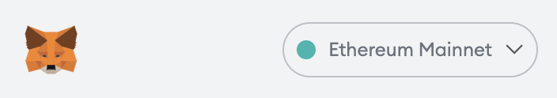
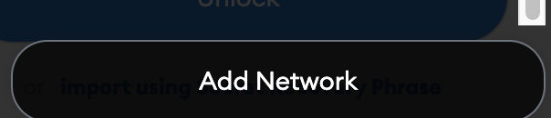

다음을 방문하여 EOS EVM 네트워크(메인넷 및 테스트넷)를 메타마스크에 쉽게 추가할 수 있습니다.
[**체인리스트**](https://chainlist.org/?search=EOS&testnets=true) **"지갑 연결"** 버튼을 클릭합니다.

## 수동으로 추가하기

MetaMask 지갑을 열고 상단 중앙에 있는 네트워크를 클릭하십시오:

클릭 `Add network` 드롭다운 목록의 끝에서:

다음 세부 정보를 추가합니다.

* `Network Name`: EOS EVM 네트워크
* `Chain ID`: 17777
* `New RPC URL`: https://api.evm.eosnetwork.com/
* `Currency Symbol`: EOS
* `Block Explorer URL (Optional)`: https://explorer.evm.eosnetwork.com/
* `Token Bridge`: https://bridge.evm.eosnetwork.com/

<상세>
    
테스트넷 세부 정보를 보려면 여기를 클릭하십시오.

* `Network Name`: EOS EVM 네트워크 테스트넷
* `Chain ID`: 15557
* `New RPC URL`: https://api.testnet.evm.eosnetwork.com/
* `Currency Symbol`: EOS
* `Block Explorer URL (Optional)`: https://explorer.testnet.evm.eosnetwork.com/
* `Token Bridge`: https://bridge.testnet.evm.eosnetwork.com/

</세부 사항>

이제 저장을 클릭하면 MetaMask 드롭다운 목록에 새 네트워크가 표시됩니다.
