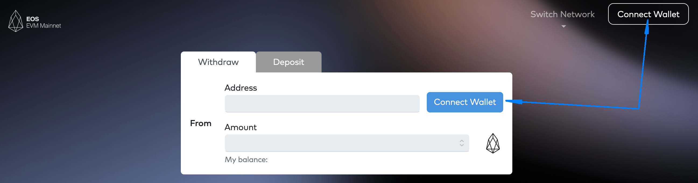
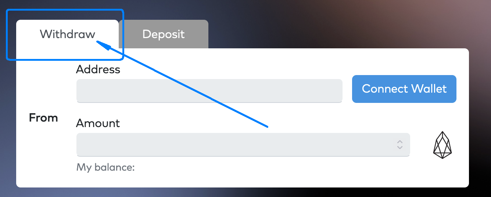
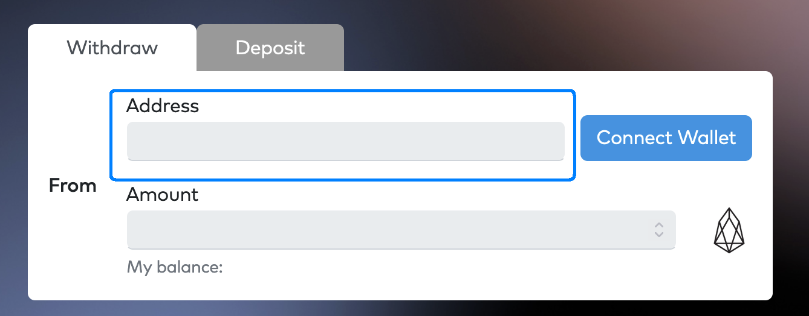
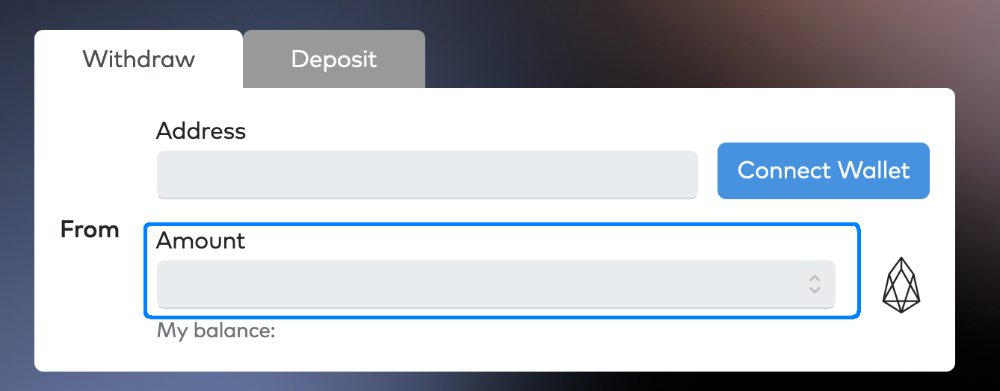
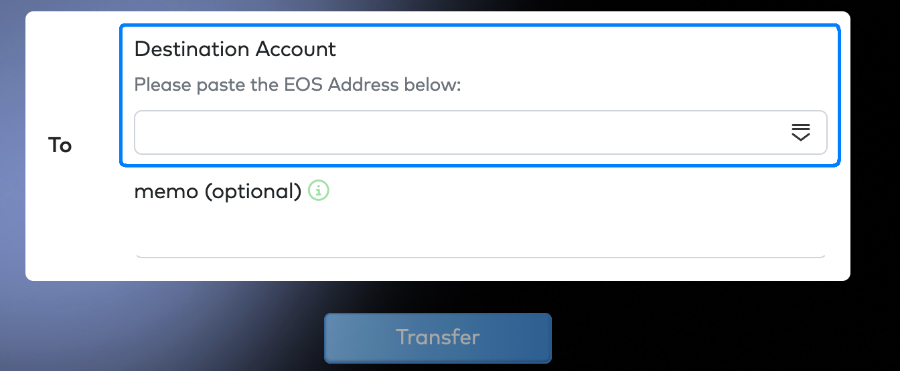
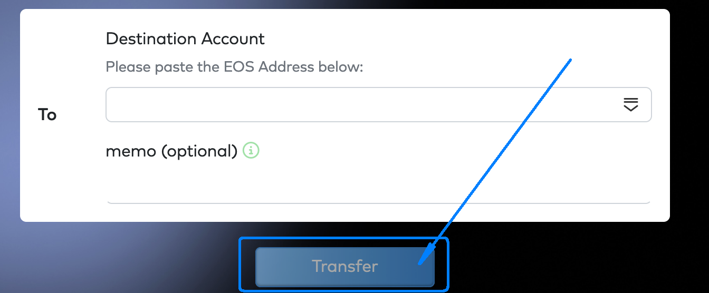

## 동기 부여

일부 거래소는 아직 EOS에서 인라인 전송 추적을 지원하지 않아 EOS EVM 전송을 볼 수 없습니다. 이것은 귀하가 해당 교환을 사용할 수 없다는 것을 의미하지 않습니다. 자금이 안전한지 확인하기 위해 몇 가지 추가 조치를 취하기만 하면 됩니다.

## 전제 조건

이 가이드는 EOS 지갑과 메인넷 또는 테스트넷의 EOS 계정 간에 EOS 토큰을 전송하는 프로세스에 익숙하다고 가정합니다.

## 단계

EOS EVM 브리지를 사용하여 EOS EVM 주소에서 교환 주소/계정으로 EOS 토큰을 전송하려면 다음 단계를 따르십시오.

1. 로 이동 [EOS EVM 브리지](https://bridge.evm.eosnetwork.com/).
2. 클릭 `Connect Wallet` 버튼을 누르고 원하는 지갑(예: Metamask)을 연결합니다.
\

3. 이제 지갑이 EOS EVM 메인넷을 활성화했는지 확인하십시오.
4. EOS EVM 브리지로 돌아가서 `Withdraw` 탭이 활성 상태이고 그렇지 않은 경우 클릭하여 활성화합니다.
\

5. 에 `From` 패널, `Address` 필드에는 이제 EOS EVM 주소가 포함되어야 합니다.
\

6. 에 `From` 패널에서 `Amount` 필드, EOS 메인넷으로 전송하려는 EOS 토큰의 양.
\

7. 에 `To` 패널에서 `Destination Account` 필드에 EOS 토큰을 전송할 EOS 메인넷 계정을 입력하십시오.
\

8. 다음을 클릭합니다. `Transfer` 단추; 이제 연결하려는 기본 지갑이 활성화되어 전송 거래 정보를 제공합니다.
\

9. 제시된 모든 거래 정보를 확인하고 동의하면 클릭 `Confirm` 거래를 승인합니다.
10. 몇 초 안에 EOS 블록체인 탐색기 또는 EOS 지갑을 사용하여 EOS 메인넷 계정 잔액을 확인할 수 있습니다.
11. 토큰이 EOS 메인넷 계정에 있으면 EOS 지갑을 사용하여 모든 교환 주소/계정으로 전송할 수 있습니다.
