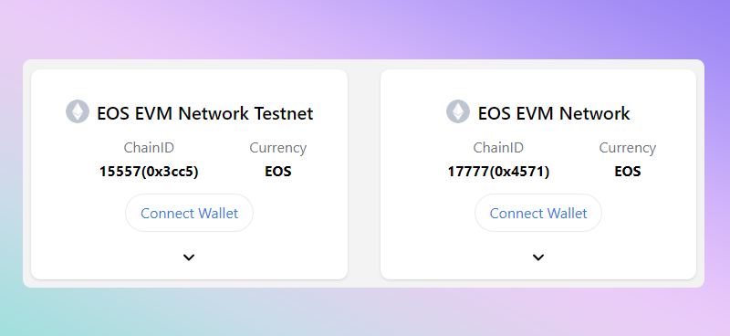
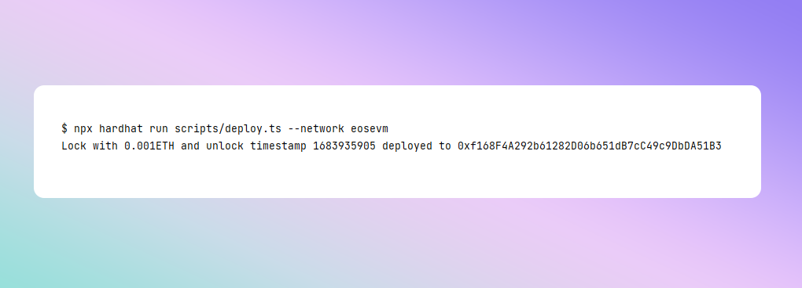

이 가이드는 EOS EVM 메인넷과 테스트넷 모두에서 안전모를 사용하여 EOS EVM에 스마트 계약을 배포하는 방법을 알려줍니다.

## 메타마스크 설정

클릭 한 번으로 EOS EVM Testnet 네트워크를 MetaMask에 추가할 수 있습니다. [**체인리스트**](https://chainlist.org/?search=EOS&testnets=true).

사용하려는 네트워크를 선택하고 **지갑 연결** 버튼을 클릭하기만 하면 됩니다.



기존 이더리움 주소는 EOS EVM에서 작동하므로 이더리움에 사용하는 것과 동일한 지갑을 사용할 수 있습니다.
또는 다른 EVM 호환 체인.

## EOS 토큰 받기

테스트넷에 있는 경우 다음을 사용하여 일부 EOS 토큰을 얻을 수 있습니다. [**테스트넷 수도꼭지**](https://faucet.testnet.evm.eosnetwork.com/).

메인넷에 있는 경우 거래소에서 일부 EOS 토큰을 구입해야 합니다. EOS와 별차이가 없습니다.
EOS 네트워크의 EVM 및 EOS에서. 그것들은 동일한 토큰이며 상호 교환하여 사용할 수 있습니다. EOS 토큰이 있으면 표준 EOS 전송을 사용하여 EOS EVM 주소로 전송할 수 있습니다.
- 토큰 보내기: `eosio.evm`
- 설정 `memo` EOS EVM 주소로

그만큼 `eosio.evm` 계약은 귀하가 보낸 토큰을 귀하의 EOS EVM 주소로 전달할 것입니다.

## 안전모 구성

새로운 안전모 프로젝트를 설정하려면 [빠른 시작](https://hardhat.org/hardhat-runner/docs/getting-started#quick-start)
가이드.


당신의 `hardhat.config.js` 파일을 만들고 다음 구성을 추가합니다.


```javascript
const config: HardhatUserConfig = {
    // ...

    networks: {
        eosevm: {
            url: "https://api.evm.eosnetwork.com",
            accounts:[process.env.PRIVATE_KEY],
        },
        eosevm_testnet: {
            url: "https://api.testnet.evm.eosnetwork.com",
            accounts:[process.env.PRIVATE_KEY],
        }
    }
};
```

> 🔑 **개인 키**
>
> 우리가 사용하고 있음에 유의하십시오. `process.env.PRIVATE_KEY` 개인 키가 코드에 노출되지 않도록 합니다.
> 이것은 다음과 같은 것을 사용해야 함을 의미합니다. `dotenv` 환경에 키를 주입하기 위해
> 환경에 수동으로 추가하거나 환경 변수를 개인 키로 직접 바꿀 수 있습니다.
>
> 그러나 공개 저장소에 커밋될 수 있으므로 실제 키를 이 파일에 넣는 데 주의하십시오.
> 절대 누구와도 개인 키를 공유해서는 안 됩니다.

## 계약 배포

이제 계약을 EOS EVM 테스트넷에 배포할 수 있습니다.

```bash
npx hardhat run scripts/deploy.js --network eosevm

// or for testnet
npx hardhat run scripts/deploy.js --network eosevm_testnet
```

배포되면 새 계약의 주소가 표시되며 붙여넣기하여 탐색기에서 볼 수 있습니다.
검색 필드에.

- [**테스트넷 익스플로러**](https://explorer.testnet.evm.eosnetwork.com/)
- [**메인넷 익스플로러**](https://explorer.evm.eosnetwork.com/)



## 축하해요!

첫 번째 스마트 계약을 EOS EVM에 성공적으로 배포했습니다! 🎉

스마트 계약과 상호 작용하는 프런트 엔드 애플리케이션이 이미 있는 경우 이제 다음을 가리킬 수 있습니다.
[EOS EVM 끝점](./10_endpoints.md) 예상대로 작동합니다.

를 방문했는지 확인하십시오. [**호환성**](../30_compatibility/index.md) 차이점에 대해 알아보는 섹션
EOS EVM 및 Ethereum, web3 애플리케이션이 예상대로 EOS EVM에서 작동하는지 확인하는 방법.
