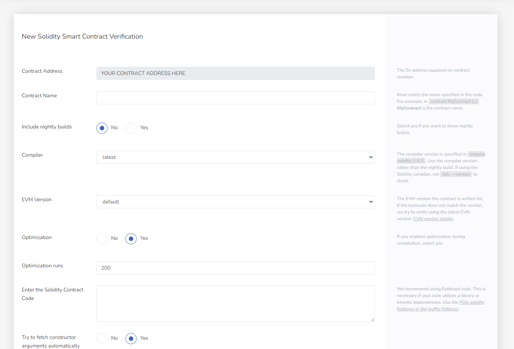

스마트 계약을 확인하려면 다음을 알아야 합니다.

- 스마트 계약 주소
- 배포된 계약이 컴파일된 컴파일러 버전
- EVM 버전
- 스마트 계약을 위한 견고성 플랫 소스 코드

## 인증 페이지로 이동

이 URL을 복사하고 `SMART_CONTRACT_ADDRESS` 귀하의 스마트 계약 주소로:

```https://explorer.evm.eosnetwork.com/address/SMART_CONTRACT_ADDRESS/verify-via-flattened-code/new
```

브라우저에 붙여넣으면 다음 페이지가 표시됩니다.



## 인증 절차 완료

1. 모든 필드를 채우십시오.
3. Solidity 계약 소스 코드 복사 및 붙여넣기
4. 클릭 `Verify & Push` 단추
