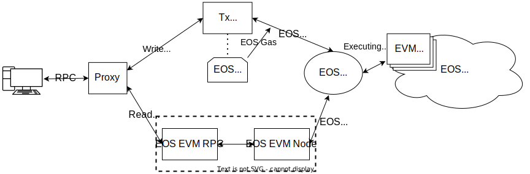

EOS EVM은 EOS 네트워크에서 실행되는 스마트 계약을 구현합니다.
`EVM Contract`. 트랜잭션을 EOS EVM 네트워크로 보내려면 트랜잭션을 EVM 계약으로 보내야 합니다.
EOS EVM 계약은 다음과 같은 몇 가지 작은 차이점을 제외하고 이더리움 EVM과 완벽하게 호환됩니다.
에서 상담했다 [EVM 호환성](../30_compatibility/10_evm-compatibility.md) 부분.

완전한 RPC 호환성을 달성하기 위해 완전한 기능을 하는 이더리움 노드가 활용됩니다. EOS EVM 테스트넷 및 메인넷
Silkworm 노드 위에 구축된 Ethereum 노드를 사용합니다. `EOS EVM Node`.

EOS EVM 클라이언트가 보낸 모든 RPC 요청, 읽기 및 쓰기는 먼저 프록시 구성 요소에 의해 처리됩니다.
다음과 같이 요청을 리디렉션합니다.

- EOS EVM RPC 구성 요소에 대한 읽기 및
- 트랜잭션 래퍼 서비스에 대한 쓰기입니다.

### 읽기 요청

JSON-RPC 읽기 요청은 다음의 포크인 EOS EVM RPC 구성 요소에 의해 지원됩니다.
[실크RPC](https://github.com/torquem-ch/silkrpc) 거의 모든 Ethereum을 지원하는 데몬으로 구현
EOS EVM 계약에서 관리하는 가상 EVM 블록체인용 JSON-RPC. RPC 방법 중 두 가지, `eth_sendRawTransaction` 
그리고 `eth_gasPrice` 이 데몬이 처리하는 것이 적절하지 않기 때문에 의도적으로 비활성화됩니다. 대신 요청
두 메서드는 이 두 RPC 메서드를 지원하도록 특별히 설계된 트랜잭션 래퍼 서비스로 라우팅됩니다.

EOS EVM RPC 구성 요소는 (가상) EVM 블록체인용 실행 클라이언트가 관리하는 데이터베이스에 의존합니다. 처형
클라이언트는 EOS EVM 노드 구성 요소로, [누에](https://github.com/torquem-ch/silkworm) 작동하도록 수정
EOS EVM을 지원하는 데 필요한 EVM 런타임에 대한 변경 사항과 함께. 신뢰할 수 없는 다리.

EOS EVM 노드는 EOS EVM 계약에 의해 처음 수행된 EVM 트랜잭션 실행을 정확하게 재현해야 합니다.
EVM 컨트랙트에서 추출한 데이터를 이용하여 EOS EVM Contract에서 관리하는 가상 EVM 블록체인을 재구성해야 합니다.
이오스 블록체인. 이를 용이하게 하기 위해 EOS EVM 노드는 EOS 노드의 SHiP(상태 기록 플러그인) 끝점에 연결합니다.
EOS 블록체인의 일부입니다.

이 아키텍처는 필요한 경우 Ethereum 클라이언트 Web3 JSON RPC API 및 잠재적으로 다른 API를 노출할 수 있게 합니다.

### 쓰기 요청

앞서 언급한 바와 같이 두 가지 RPC 방식은 `eth_sendRawTransaction` 그리고 `eth_gasPrice`, EOS EVM RPC에 의해 구현되지 않습니다.
대신 그들은에 의해 구현됩니다 `Transaction Wrapper` (아래 도표에서 `Tx Wrapper`) 요소. 그러므로 모든
*쓰기 요청*은 트랜잭션 래퍼로 전달되어 EOS 작업으로 압축되어 EVM 계약으로 전송됩니다.

트랜잭션 래퍼의 주요 목적은 다음을 통해 원시 EVM 트랜잭션을 가져오는 것입니다. `eth_sendRawTransaction` 그리고 밀어
EOS EVM 계약에
다음 단계를 통해 이를 수행합니다.

1. 다음을 포함하는 EOS 트랜잭션을 구성합니다. `pushtx` rlp로 인코딩된 EVM 트랜잭션을 포함하는 EOS EVM 계약의 조치.
2. 채굴자 역할을 하는 EOS 계정의 키로 EOS 트랜잭션을 노래한다. `pushtx` 조치를 취하고 EOS 트랜잭션의 CPU/NET 비용을 지불합니다.
3. 서명된 EOS 트랜잭션을 EOS 네트워크에 연결된 EOS 노드의 체인 API를 통해 EOS 블록체인으로 보냅니다.

트랜잭션 래퍼는 다음을 지원합니다. `eth_gasPrice` RPC 방식은 읽기 방식임에도 불구하고
구현은 또한 EOS 노드의 체인 API에 대한 액세스에 따라 달라집니다. 특히, 단순히 최소 가스 가격을 잡습니다.
해당 테이블에서 EOS EVM 계약에 구성하고 호출자에게 반환합니다.

이 아키텍처는 필요한 경우 이더리움 노드의 다른 구현을 사용할 가능성을 허용합니다.
일부 특정 시나리오의 경우.
