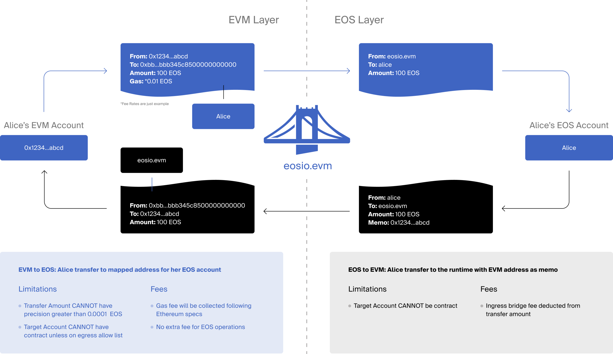
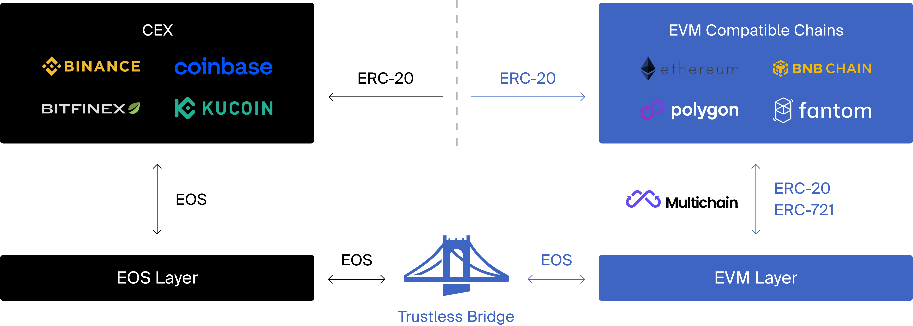
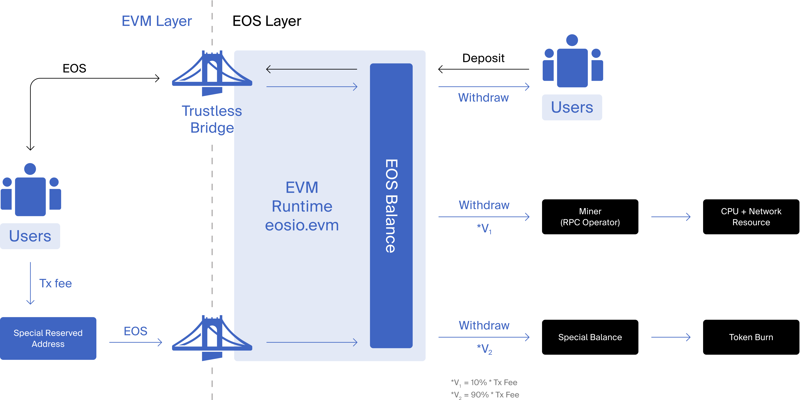

모든 EVM에는 가스 수수료라고도 하는 거래 수수료를 충당하기 위해 기본 토큰이 필요합니다.
EOS EVM 네이티브 토큰은 EOS 토큰입니다.

## EOS EVM 브리지

상호 운용성은 EOS EVM 설계의 핵심 부분입니다. 따라서 EVM 설계는 경제적 가치가 자유롭게 흐르도록 합니다.
네이티브 레이어와 EVM 레이어 사이. 여기에서 EVM의 신뢰할 수 없는 브리지가 작동합니다.

신뢰할 수 없는 브리지를 사용하면 사용자는 EOS 네이티브에서 EOS EVM으로 토큰을 이동하기 위해 타사 오라클에 의존할 필요가 없습니다.
대신 토큰을 EOS EVM 계약인 eosio.evm으로 보내고 EOS EVM 주소를 입력하면 됩니다.
메모 필드에 지갑. 이렇게 하면 자산이 기본 레이어에서 EVM의 지정된 주소로 이동합니다. 때
사용자가 자산을 다시 EOS 네이티브로 옮기고자 하는 경우 브리지를 통해 EVM 트랜잭션이 EOS 전송을 트리거할 수 있습니다.
선택적 메모와 함께 EOS EVM 계약에서 사용자가 지정한 EOS 기본 계정으로. 브릿지 프론트엔드는
사용자가 이러한 유형의 EVM 트랜잭션을 쉽게 구성할 수 있습니다.

### 브릿지 수수료 내역

나가는 브리지 전송을 포함하는 모든 EVM 트랜잭션은 사용자가 가스 요금을 지불해야 합니다. 이 수수료는 다음을 포함합니다.
다음 섹션에서 자세히 설명하는 시스템의 일반 비용
그만큼 [EOS EVM 가스 모델](#eos-evm-gas-model).

그러나 들어오는 브리지 전송은 EOS 거래로 시작하여 EOS EVM 계약이 내부적으로
EVM 트랜잭션을 생성합니다. 내부 EVM 트랜잭션은 비용이 발생하며, EOS EVM에서 생성되었기 때문에
계약, 사용자가 해당 내부 트랜잭션의 가스 요금을 직접 지불할 수 있는 메커니즘이 없습니다. 대신에,
EOS EVM 계약은 수신에서 약간의 브리지 수수료를 공제하여 해당 내부 EVM 거래 비용을 충당합니다.
이체 금액. 변동 가능성이 있는 브릿지 수수료로 인한 사용자 혼란을 방지하기 위해 브릿지 수수료는 여전히 구성 가능하지만,
계산된 실제 가스 요금과 직접적으로 연결되지 않습니다. 대신 시스템이 수익성을 유지하도록 구성됩니다.
평균적으로. 출시 시 들어오는 브리지 전송당 0.01 EOS의 브리지 수수료가 구성됩니다. 하지만 정적 브리지 요금과
수익성 목표는 내부 EVM 트랜잭션의 가스 한도가 보수적으로 지원에만 설정됨을 의미합니다.
외부 소유 계정을 대상으로 합니다.

또한 나가는 브리지 전송을 실행하는 EVM 트랜잭션에는 가스 요금 징수가 필요하지만,
가스 요금은 EVM에서 발생하는 계산 비용만 포함합니다. 나가는 브리지 전송은 일반적으로 트리거할 수 있습니다.
대상 계정에서 실행할 임의의 EOS 기본 스마트 계약 코드이며 이 추가 계산은 없습니다.
비용은 계산된 가스 요금에 포함됩니다. 이러한 이유로 나가는 브리지 전송은 최대 하나에 보낼 수 있습니다.
EVM 트랜잭션당 외부 EOS 계정. 해당 계정에는 계약이 배포되어 있지 않거나
특별 이그레스 허용 목록.

단일 EVM 트랜잭션이 다른 계정으로 여러 발신 브리지 전송을 가질 수 있습니다. 하지만,
이를 위해서는 대상 계정이 먼저 생성되는 EOS EVM 계약 내에서 고급 기능을 사용해야 합니다.
EOS EVM 계약 내에서 내부 잔액을 개설하고 나중에 해당 내에서 수집된 자금을 인출합니다.
외부 EOS 계정에 균형을 맞춥니다.

### EVM 사용자를 위한 사용자 경험

신뢰할 수 없는 브리지는 또한 다른 EVM 기반 생태계에서 EOS EVM으로 오는 사용자에 대한 눈에 띄는 장벽을 제거합니다.
그것이 EOS 네이티브 계정을 생성해야 하는 이유입니다. 어렵지는 않지만 사용하는 사람들에게는 그 과정이 낯설다.
MetaMask와 같은 이더리움 지갑을 통해 블록체인과 상호 작용합니다. 추가적으로 비용이 추가됩니다
최종 사용자에게 추가 마찰을 일으키는 EOS 기본 계정 생성과 관련됩니다.

이를 해결하기 위해 사용자가 EOS EVM과만 상호작용하기를 원하는 경우 애플리케이션에서 무료 주소를 생성하기만 하면 됩니다.
MetaMask처럼 EVM에 연결합니다. 그런 다음 거래소에서 EOS 기본 토큰을 구매하여 보낼 수 있습니다.
신뢰할 수 없는 브리지를 활용하여 EOS EVM 안팎으로. 이것은 원활한 사용자 경험을 제공합니다.
최종 사용자는 EOS 네이티브와 전혀 상호 작용할 필요가 없습니다.

EOS EVM의 장기 목표는 향후 EOS 외에 여러 토큰을 지원할 수 있는 기능을 활성화하는 것입니다. 에서
그 동안 멀티체인 브리지는 dApp이 토큰을 EOS EVM 경제로 쉽게 가져올 수 있도록 할 것입니다.

## EOS EVM 가스 모델

가스 모델은 EOS EVM 경제의 또 다른 중요한 부분입니다. 모든 EVM에는 트랜잭션을 처리하기 위한 기본 토큰이 필요합니다.
수수료, 가스 수수료라고도 함. 이더리움 네트워크에서 이것은 ETH가 됩니다. EOS 토큰은 다음을 위한 가스 토큰 역할을 합니다.
EVM. 이것은 단순한 디자인을 보장하는 동시에 EOS 토큰에 추가 유틸리티를 제공합니다.

### 가스 요금 계산

EOS EVM 계약은 EOS 블록체인에서 실행되기 때문에 EVM 내에서 발생하는 일과 상관없이 궁극적으로 EOS 네이티브
RAM, CPU 및 NET과 같은 리소스가 활용되고 있습니다. EVM과 EOS 네이티브의 리소스 모델은 상당히 다릅니다.
이는 특히 영구 계약 저장 비용과 관련하여 그들 사이의 매핑을 까다롭게 만듭니다.

EOS 네이티브는 RAM 토큰의 소유권이 해당 토큰에 대한 자격을 나타내는 RAM에 대한 소유권 모델을 사용합니다.
계정 및 계약에 대한 영구 저장 공간의 바이트 양. 이 RAM 토큰은
EOS를 통한 온체인 시장. 계정/계약이 더 이상 전체 저장 공간을 필요로 하지 않는 경우
RAM 토큰은 EOS 계정에 보관되며 여유 공간은 나중에 다른 저장소에 효율적으로 재사용할 수 있습니다.
또는 남은 RAM을 온체인 시장에서 EOS용으로 판매할 수 있습니다.

EOS의 다른 계산 리소스는 CPU와 NET입니다. 그러나 이들은 일시적인 리소스로 획득할 수 있습니다.
예를 들어 PowerUp을 통해 정기적으로 또는 EOS로 비용을 지불합니다.

반면에 EVM은 가스 요금을 사용하여 저장 비용을 처리합니다.
거래 비용. 이는 사용자가 비용을 지불하는 방법을 단순화합니다. 그러나 그것은 제한된 기회를 제공합니다
계약이 더 이상 많은 데이터를 저장할 필요가 없는 경우 가치를 복구합니다.

가스 요금과 RAM과 같은 기본 리소스 비용 간의 매핑은 최대 호환성과 단순성을 목표로 합니다.
최종 사용자, 특히 초기 출시 동안. EVM 트랜잭션의 가스 사용량을 계산하는 알고리즘은
다른 대중적인 EVM과 마찬가지로 EOS EVM도 마찬가지입니다. 사용자가 지불하는 가스 요금은 가스 사용량을 곱한 것입니다.
트랜잭션에 설정된 가스 가격으로. 이는 구성 가능한 최소 가스를 충족하기 위해 EOS EVM 계약에 의해 시행됩니다.
가격. 그런 다음 가스 요금은 분할되어 시스템의 필요한 비용을 충당하기 위해 적절하게 라우팅됩니다.

### EOS EVM에서 EOS Native로의 가스 수수료 경로

EVM 트랜잭션 처리와 관련된 두 가지 계산 비용이 있습니다.

#### EOS 기본 계산 비용

첫 번째 비용은 CPU 및 NET에 대한 EOS 기본 계산 비용으로, EOS 계정으로 처리해야 합니다.
EVM 트랜잭션을 래핑하는 EOS 트랜잭션의 첫 번째 권한 부여자. EVM 거래의 가스 수수료 중 일부는
그들이 자신을 주장하는 경우 이 EOS 계정으로 라우팅됩니다. `miner` EVM 트랜잭션의 내부를 열었습니다.
EOS EVM 계약 내 잔액.

이 광부의 내부 잔고로 라우팅되는 가스 요금의 비율은 다음과 같은 구성 가능한 매개변수에 의해 결정됩니다.
광부 컷이라고 불리는 EOS EVM 계약. 마이너 컷에 대한 적절한 값과 최소 가스 가격을 설정함으로써
EOS EVM 계약에서 채굴자들은 평균을 충당하기에 충분한 가스 수수료 부분을 받을 것으로 예상됩니다.
CPU 및 NET 비용과 유효한 EVM 트랜잭션 수락, 래핑에 중점을 둔 제한된 RPC 노드 실행 비용
EOS 거래에서 그것들을 EOS 블록체인에 제출합니다. 누구나 광부 역할을 할 수 있지만,
ENF는 MetaMask와 같은 지갑이 기대하는 신뢰할 수 있는 RPC 끝점을 보장하기 위해 이 서비스를 제공할 것입니다.
시작부터 즉시 사용할 수 있습니다.

#### 내부 EVM 운영 비용

두 번째 비용은 주로 EOS EVM 계약의 RAM 소비로 구성되는 내부 EVM 운영 비용입니다.
이 비용은 채굴자에게 전달되지 않는 EVM 트랜잭션의 가스 수수료 중 나머지 부분으로 충당됩니다.
다시 말하지만, 광부 컷 및 최소 가스 가격 매개변수를 적절하게 조정하면 다음을 위해 충분한 수수료를 징수할 수 있습니다.
수익성을 유지하는 시스템. 이 수수료는 eosio.evm 계정의 특별한 내부 잔액에 축적됩니다.
언제든지 활성 권한의 승인으로 철회할 수 있습니다.

