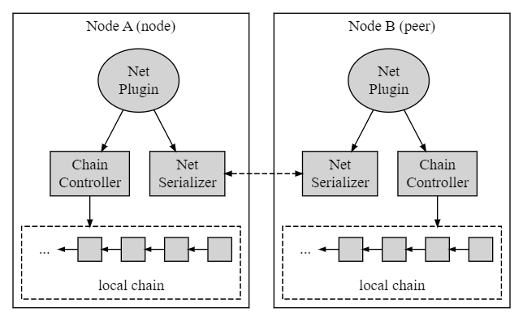
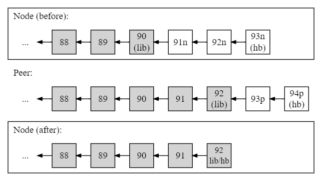
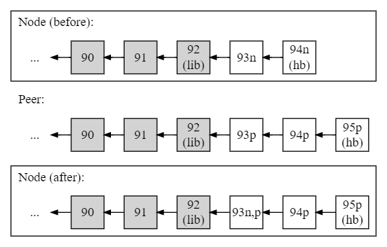
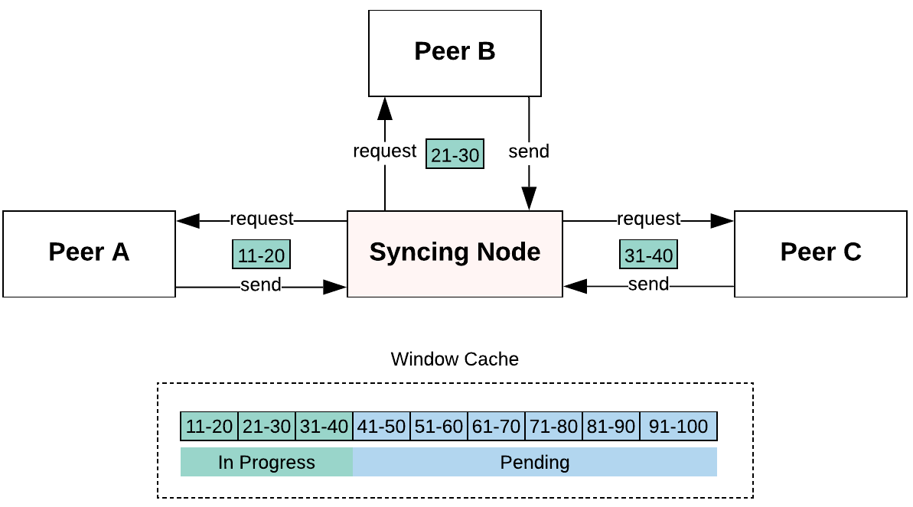

## 1. 개요

EOS 블록체인의 노드는 거래 중계, 블록 푸시, 피어 간의 상태 동기화를 위해 서로 통신할 수 있어야 합니다. P2P(Peer-to-Peer) 프로토콜은 `nodeos` 모든 노드에서 실행되는 서비스가 이 목적을 수행합니다. 상태를 동기화하는 기능은 각 블록이 결국 블록체인의 글로벌 상태 내에서 최종성에 도달하고 각 노드가 마지막 비가역 블록(LIB)을 진행할 수 있도록 하는 데 중요합니다. 이와 관련하여 p2p 프로토콜의 기본 목표는 블록을 동기화하고 노드 간에 트랜잭션을 전파하여 합의에 도달하고 블록체인 상태를 발전시키는 것입니다.


### 1.1. 목표

블록에 여러 트랜잭션을 추가하고 지정된 생성 시간인 0.5초 내에 맞추려면 속도와 효율성을 염두에 두고 p2p 프로토콜을 설계해야 합니다. 이 두 가지 목표는 유효 대역폭 내에서 트랜잭션 처리량을 최대화하고 네트워크 및 운영 대기 시간을 모두 줄이는 것으로 해석됩니다. 이를 달성하기 위한 몇 가지 전략은 다음과 같습니다.

* 더 나은 규모의 경제를 위해 블록 내에 더 많은 트랜잭션을 맞춥니다.
* 블록 및 트랜잭션 간의 중복 정보를 최소화합니다.
* 노드 상태의 보다 효율적인 브로드캐스팅 및 동기화를 허용합니다.
* 데이터 압축 및 바이너리 인코딩으로 페이로드 공간을 최소화합니다.

이러한 전략의 대부분은 EOS 소프트웨어에서 완전히 또는 부분적으로 구현됩니다. 선택적 데이터 압축은 트랜잭션 수준에서 구현됩니다. 이진 인코딩은 네트워크를 통해 개체 인스턴스 및 프로토콜 메시지를 보낼 때 net serializer에 의해 구현됩니다.


## 2. 아키텍처

p2p 프로토콜의 주요 목표는 노드를 안전하고 효율적으로 동기화하는 것입니다. 이 중요한 목표를 달성하기 위해 시스템은 기능을 네 가지 주요 구성 요소로 위임합니다.

* **Net Plugin**: 블록을 동기화하고 피어 간에 트랜잭션을 전달하는 프로토콜을 정의합니다.
* **Chain Controller**: 노드 내에서 수신된 블록 및 트랜잭션을 발송/관리합니다.
* **Net Serializer**: 네트워크 전송을 위해 메시지, 블록 및 트랜잭션을 직렬화합니다.
* **로컬 체인**: 가역 블록을 포함하여 노드의 블록체인 로컬 복사본을 보유합니다.

위 구성 요소 간의 상호 작용은 아래 다이어그램에 설명되어 있습니다.



최상위 수준에는 노드와 피어 간에 메시지를 교환하여 블록과 트랜잭션을 동기화하는 Net Plugin이 있습니다. 일반적인 메시지 흐름은 다음과 같습니다.

1. 노드 A는 Net Plugin을 통해 노드 B에게 메시지를 보냅니다(위 그림 참조).
    1. 노드 A의 Net Serializer는 메시지를 압축하여 노드 B로 보냅니다.
    2. 노드 B의 Net Serializer는 메시지의 압축을 풀고 이를 Net Plugin으로 전달합니다.
2. 메시지는 Node B의 Net Plugin에 의해 처리되어 적절한 작업을 전달합니다.
3. Net Plugin은 필요한 경우 블록을 푸시하거나 검색하기 위해 Chain Controller를 통해 로컬 체인에 액세스합니다.


### 2.1. 로컬 체인

로컬 체인은 노드의 블록체인 로컬 복사본입니다. 이것은 노드가 수신한 비가역 블록과 가역 블록으로 구성되며 각 블록은 이전 블록과 암호로 연결됩니다. 되돌릴 수 없는 블록 목록에는 변경할 수 없는 블록체인의 실제 복사본이 포함됩니다. 가역 블록 목록은 일반적으로 길이가 더 짧고 체인 컨트롤러가 블록을 푸시할 때 포크 데이터베이스에서 관리합니다. 로컬 체인은 다음과 같습니다.

")

각 노드는 블록과 트랜잭션을 수신하고 해당 상태를 다른 피어와 동기화할 때 블록체인의 자체 로컬 복사본을 구성합니다. 가역 블록은 아직 최종 상태에 도달하지 않은 수신된 새 블록입니다. 따라서 이들은 주요 공통 조상인 LIB(마지막 비가역 블록)에서 유래하는 가지를 형성할 가능성이 높습니다. 가역 블록에 대해 LIB와 다른 다른 공통 조상도 가능합니다. 실제로 두 형제 가지에는 항상 가장 가까운 공통 조상이 있습니다. 예를 들어 위의 다이어그램에서 블록 52b는 LIB와 다른 블록 53a 및 53b에서 시작하는 분기의 가장 가까운 공통 조상입니다. 로컬 체인의 모든 활성 지점은 블록체인의 일부가 될 가능성이 있습니다.

#### 2.1.1. LIB 블록

노드에 구성된 모든 비가역 블록은 각 노드의 마지막 비가역 블록(LIB)까지 다른 노드의 블록과 일치할 것으로 예상됩니다. 이것이 블록체인의 분산 특성입니다. 결국 LIB 블록을 따르는 블록이 최종 상태에 도달하면 LIB 블록은 헤드 블록(HB)을 따라잡으면서 분기 중 하나를 통해 체인 위로 이동합니다. LIB 블록이 발전하면 불변 블록체인이 효과적으로 성장합니다. 이 프로세스에서 헤드 블록은 수신된 잠재적 헤드 블록 번호와 궁극적으로 타이브레이커로 사용되는 타임스탬프에 따라 분기를 여러 번 전환할 수 있습니다.

### 2.2. 체인 컨트롤러

체인 컨트롤러는 트랜잭션 유효성 검사 및 실행, 블록 푸시 등과 같이 로컬 체인 상태를 변경하는 블록 및 트랜잭션에 대한 기본 작업을 관리합니다. 체인 컨트롤러는 Net Plugin에서 명령을 수신하고 블록 또는 트랜잭션에 대한 적절한 작업을 파견합니다. Net Plugin이 받은 네트워크 메시지를 기반으로 합니다. 네트워크 메시지는 블록과 트랜잭션의 상태를 동기화하기 위해 서로 통신하면서 EOS 노드 간에 지속적으로 교환됩니다.

#### 2.2.1. 신호의 생산자 및 소비자

컨트롤러에 정의된 신호의 생산자 및 소비자와 정상 작동, 포크 및 재생 중 수명 주기는 다음과 같습니다.

##### pre_accepted_block (signed_block_ptr 수행)

- 생산

| 모듈 | 기능 | 조건 |
| --- | --- | --- |
| 컨트롤러 | push_block | 블록이 포크 db에 추가되기 전에 |
| | replay_push_block | replay된 블록이 fork db에 추가되기 전 (replay 중에 비가역 블록이 fork db에 추가되지 않기 때문에 replay된 블록이 비가역적이지 않은 경우에만) |

- 소비

| 모듈 | 사용법 |
| --- | --- |
| chain_plugin | 체크포인트 검증 |
| | 데이터를 pre_accepted_block_channel로 전달 |

##### Accepted_block_header (carry block_state_ptr)

- 생산

| 모듈 | 기능 | 조건 |
| --- | --- | --- |
| 컨트롤러 | push_block| 블록이 포크 db에 추가된 후 |
| | commit_block | fork db에 블록이 추가된 후 (자신이 블록을 생성한 경우에만, 즉 타인에게 받은 블록에는 해당되지 않음) |
| | replay_push_block | 재생된 블록이 포크 db에 추가된 후 | (replay시 fork db에 비가역 블록이 추가되지 않기 때문에 재생된 블록이 비가역이 아닌 경우에만) |

- 소비

| 모듈 | 사용법 |
| --- | --- |
| chain_plugin | 데이터를 accept_block_header_channel로 전달 |

##### Accepted_block (carry block_state_ptr)

- 생산

| 모듈 | 기능 | 조건 |
| --- | --- | --- |
| 컨트롤러 | commit_block | 블록이 완료되면 |

- 소비

| 모듈 | 사용법 |
| --- | --- |
| net_plugin | 다른 동료에게 브로드캐스트 블록 |

##### 비가역_블록(block_state_ptr 수행)

- 생산

| 모듈 | 기능 | 조건 |
| --- | --- | --- |
| 컨트롤러 | log_irreversible | 블록 로그에 추가되기 전과 chainbase db가 커밋되기 전 |
| | replay_push_block | 되돌릴 수 없는 블록을 재생할 때 |

- 소비

| 모듈 | 사용법 |
| --- | --- |
| 컨트롤러 | wasm_interface의 현재 라이브러리 설정 |
| chain_plugin | irreversible_block_channel에 데이터 전달 |

##### Accepted_transaction(transaction_metadata_ptr 수행)

- 생산

| 모듈 | 기능 | 조건 |
| --- | --- | --- |
| 컨트롤러 | push_transaction | 트랜잭션이 성공적으로 실행될 때(한 번만, 즉 적용되지 않고 다시 적용되면 신호가 방출되지 않음) |
| | push_scheduled_transaction | 예약된 트랜잭션이 성공적으로 실행될 때 |
| | | 예정된 트랜잭션이 실패했을 때 (주관적/소프트/하드) |
| | | 예정된 트랜잭션이 만료될 때 |
| | | onerror 적용 후 |

- 소비

| 모듈 | 사용법 |
| --- | --- |
| chain_plugin | Accepted_transaction_channel에 데이터 전달 |

##### added_transaction(std::tuple<const transaction_trace_ptr&, const signed_transaction&> 수행)

- 생산

| 모듈 | 기능 | 조건 |
| --- | --- | --- |
| 컨트롤러 | push_transaction | 트랜잭션이 성공적으로 실행될 때 |
| | push_scheduled_transaction | 예약된 트랜잭션이 성공적으로 실행될 때 |
| | | 예정된 트랜잭션이 실패했을 때 (주관적/소프트/하드) |
| | | 예정된 트랜잭션이 만료될 때 |
| | | onerror 적용 후 |

- 소비

| 모듈 | 사용법 |
| --- | --- |
| chain_plugin | 적용된_트랜잭션_채널로 데이터 전달 |

##### bad_alloc
사용되지 않습니다.

#### 2.2.2. 신호의 수명 주기

##### A. 블록과 트랜잭션이 입력되는 정상 동작

1. 트랜잭션이 블록체인으로 푸시될 때(RPC를 통해 또는 피어에 의해 브로드캐스트됨)
   1. 트랜잭션이 성공적으로 실행됨/검증 실패 -> `accepted_transaction` 컨트롤러에 의해 방출됩니다.
   2. chain_plugin은 transaction_metadata를 successful_transaction_channel로 전달하기 위해 신호에 반응합니다.
2. 예정된 트랜잭션이 블록체인에 푸시되는 경우
   1. 트랜잭션이 성공적으로 실행됨/주관적으로 실패/소프트 실패/하드 실패 -> `accepted_transaction` 컨트롤러에서 방출
   2. chain_plugin은 transaction_metadata를 successful_transaction_channel로 전달하기 위해 신호에 반응합니다.
3. 블록이 블록체인에 푸시될 때(RPC를 통해 또는 피어에 의해 브로드캐스트됨)
   1. 블록이 포크 db에 추가되기 전 -> `pre_accepted_block` 컨트롤러에 의해 방출됩니다
   2. chain_plugin은 블록의 유효성 검사를 수행하는 신호에 반응하여 block_state를 Accepted_block_header_channel로 전달하고 체크포인트로 유효성을 검사합니다.
   3. 포크 db에 블록 추가 후 -> `accepted_block_header` 컨트롤러에 의해 방출됩니다
   4. chain_plugin은 신호에 반응하여 block_state를 Accepted_block_header_channel로 전달합니다.
   5. 그러면 블록이 적용되며 이때 블록 내부의 모든 트랜잭션과 scheduled_transactions가 푸시됩니다. push_transaction 및 push_scheduled_transaction과 관련된 모든 신호(A.1 및 A.2 참조)가 방출됩니다.
   6. 블록 커밋 시 -> `accepted_block` 컨트롤러에 의해 방출됩니다
   7. net_plugin은 신호에 반응하고 블록을 동료에게 브로드캐스트합니다.
   8. 새로운 블록이 되돌릴 수 없게 되면 되돌릴 수 없는 블록과 관련된 신호가 방출됩니다(포인트 A.5 참조).
4. 블록이 생성된 경우
   1. 본인이 생성한 블록은 커밋 시 fork_db에 블록 추가 -> `accepted_block_header` 컨트롤러에 의해 방출됩니다
   2. chain_plugin은 신호에 반응하여 block_state를 Accepted_block_header_channel로 전달하고 체크포인트로 유효성을 검사합니다.
   3. 그 직후(블록 커밋 중) -> `accepted_block` 컨트롤러에 의해 방출됩니다
   4. net_plugin은 신호에 반응하고 블록을 동료에게 브로드캐스트합니다.
   5. 새로운 블록이 되돌릴 수 없게 되면 되돌릴 수 없는 블록과 관련된 신호가 방출됩니다(포인트 A.5 참조).
5. 블록이 되돌릴 수 없게 된 경우
   1. 블록이 되돌릴 수 없는 것으로 간주되면 -> `irreversible_block` 블록이 블록 로그에 추가되고 chainbase db가 커밋되기 전에 컨트롤러에 의해 방출됩니다.
   2. chain_plugin은 신호에 반응하여 block_state를irreversible_block_channel로 전달하고 wasm_interface의 lib도 설정합니다.

##### B. 포크가 제시되고 해결되는 작업

1. 포크가 제시되면 블록체인은 모든 기존 블록을 포크 지점까지 팝한 다음 모든 새 블록을 포크에 적용합니다.
2. 새로운 블록을 적용하면 블록 내부의 모든 트랜잭션과 scheduled_transactions가 푸시됩니다. push_transaction 및 push_scheduled_transaction과 관련된 모든 신호(A.1 및 A.2 참조)가 방출됩니다.
3. 그런 다음 새 블록을 커밋할 때 -> `accepted_block` 컨트롤러에 의해 방출됩니다
4. net_plugin은 신호에 반응하고 블록을 동료에게 브로드캐스트합니다.
5. 새로운 블록이 되돌릴 수 없게 되면 되돌릴 수 없는 블록과 관련된 신호가 방출됩니다(포인트 A.5 참조).

##### C. 일반 리플레이(리플레이 최적화 포함 또는 제외)

1. 되돌릴 수 없는 블록 재생 시 -> `irreversible_block` 컨트롤러에 의해 방출됩니다
2. 방법을 보려면 A.5를 참조하십시오. `irreversible_block` 신호가 응답된다
3. reversible 블록 재생시 fork_db에 블록이 추가되기 전 -> `pre_accepted_block` 컨트롤러에 의해 방출됩니다
4. 리버서블 블록 재생시 해당 블록이 포크 db에 추가된 후 -> `accepted_block_header` 컨트롤러에 의해 방출됩니다
5. 가역 블록 재생 시 블록 커밋 시 -> `accepted_block` 컨트롤러에 의해 방출됩니다
6. 방법을 보려면 A.3을 참조하십시오. `pre_accepted_block`, `accepted_block_header` 그리고 `accepted_block` 신호 응답

#### 2.2.3. 포크 데이터베이스

포크 데이터베이스(Fork DB)는 체인 컨트롤러가 노드의 로컬 체인에서 작업을 수행할 수 있도록 내부 인터페이스를 제공합니다. 다른 피어로부터 새 블록을 수신하면 체인 컨트롤러가 이 블록을 Fork DB로 푸시합니다. 그런 다음 각 블록은 이전 블록에 암호화 방식으로 연결됩니다. 하나 이상의 이전 블록이 있을 수 있으므로 프로세스는 미니 포크라는 임시 분기를 생성할 수 있습니다. 따라서 Fork DB는 세 가지 주요 목적을 제공합니다.

* 푸시된 블록(새 헤드 블록)이 어느 분기에서 시작되는지 결정합니다.
* 헤드 블록, 루트 블록 및 LIB 블록을 전진시킵니다.
* 유효하지 않은 분기를 잘라내고 고아 블록을 제거합니다.

본질적으로 Fork DB에는 블록체인을 계속 성장시키는 실제 분기가 될 수 있는 노드 내의 모든 후보 블록 분기가 포함되어 있습니다. 루트 블록은 항상 가역 블록 트리의 시작을 표시하고 LIB가 전진하는 경우를 제외하고는 LIB 블록과 일치합니다. 이 경우 루트 블록이 따라잡아야 합니다. Fork DB 내의 새 블록을 통해 진행되는 LIB 블록의 계산은 궁극적으로 어떤 분기가 선택되는지를 결정합니다. LIB 블록이 진행됨에 따라 루트 블록은 새로운 LIB를 따라잡고 조상 노드가 LIB 뒤에 있는 모든 후보 분기가 가지치기됩니다. 아래에 설명되어 있습니다.

")

위의 다이어그램에서 블록 52b에서 시작하는 분기는 LIB가 노드 51에서 블록 52c, 53c로 진행한 후 제거됩니다(블록 52b, 53a, 53b는 유효하지 않음). LIB가 가역 블록을 통과하면서 Fork DB에서 로컬 체인으로 이동하여 이제 불변 블록체인의 일부가 되었습니다. 마지막으로 블록 54d는 포크 DB에 보관됩니다. 새 블록이 계속 생성될 수 있기 때문입니다.


### 2.3. 넷 플러그인

Net Plugin은 EOS 노드 간의 실제 P2P 통신 메시지를 정의합니다. Net Plugin의 주요 목표는 요청 시 유효한 블록을 동기화하고 유효한 트랜잭션을 변함없이 전달하는 것입니다. 이를 위해 Net Plugin은 기능을 다음 구성 요소에 위임합니다.

* **동기화 관리자**: 피어와 관련하여 노드의 블록 동기화 상태를 유지합니다.
* **Dispatch Manager**: 노드가 보낸 블록 및 트랜잭션 목록을 유지합니다.
* **연결 목록**: 노드가 현재 연결된 활성 피어 목록입니다.
* **메시지 핸들러**: 프로토콜 메시지를 해당 핸들러로 발송합니다. (보다 [4.2. 프로토콜 메시지](#42-protocol-messages)).


#### 2.3.1. 동기화 관리자

Sync Manager는 노드와 해당 피어 간에 블록 상태를 동기화하는 기능을 구현합니다. 각 피어가 보낸 메시지를 처리하고 해당 피어에 대한 노드의 LIB 또는 헤드 블록 상태에 따라 블록의 실제 동기화를 수행합니다. 언제든지 노드는 다음 동기화 상태 중 하나일 수 있습니다.

* **LIB Catch-Up**: 노드가 다른 피어의 LIB 블록과 동기화하려고 합니다.
* **Head Catch-Up**: 노드가 다른 피어의 HEAD 블록과 동기화하려고 합니다.
* **In-Sync**: LIB 및 HEAD 블록이 모두 다른 피어와 동기화됩니다.

노드의 LIB 또는 헤드 블록이 뒤에 있는 경우 노드는 동기화 요청 메시지를 생성하여 연결된 피어에서 누락된 블록을 검색합니다. 마찬가지로 연결된 피어의 LIB 또는 헤드 블록이 뒤에 있는 경우 노드는 동기화해야 하는 블록에 대해 노드에 알리기 위해 알림 메시지를 보냅니다. 동기화 모드에 대한 자세한 내용은 다음을 참조하세요. [3. 작동 모드](#3-operation-modes).


#### 2.3.2. 파견 관리자

Dispatch Manager는 노드가 받은 블록 및 느슨한 트랜잭션의 상태를 유지합니다. 상태에는 블록 또는 트랜잭션을 식별하기 위한 기본 정보가 포함되어 있으며 블록 상태 및 트랜잭션 상태의 두 가지 인덱스 목록 내에서 유지됩니다.

* **Block State List**: 수신된 모든 블록에 대해 노드가 관리하는 블록 상태 목록입니다.
* **트랜잭션 상태 목록**: 수신된 모든 트랜잭션에 대해 노드가 관리하는 트랜잭션 상태 목록입니다.

이를 통해 어떤 피어가 주어진 블록 또는 트랜잭션을 가지고 있는지 매우 빠르게 찾을 수 있습니다.


##### 2.3.2.1. 차단 상태

블록 상태는 블록과 그 블록이 온 피어를 식별합니다. 본질적으로 일시적이므로 노드가 활성 상태인 동안에만 유효합니다. 차단 상태에는 다음 필드가 포함됩니다.

블록 상태 필드 | 설명
-|-
`id` | 256비트 블록 식별자. 블록 내용과 블록 번호의 기능.
`block_num` | 생성 이후 순차적으로 블록을 식별하는 32비트 부호 없는 카운터 값입니다.
`connection_id` | 블록이 온 연결된 피어를 식별하는 32비트 부호 없는 정수입니다.
`have_block` | 노드가 실제 블록을 수신했는지 여부를 나타내는 부울 값.

블록 상태 목록은 더 빠른 조회를 위해 블록 ID, 블록 번호 및 연결 ID로 인덱싱됩니다. 이렇게 하면 하나 이상의 인덱싱된 속성이 지정된 모든 블록에 대해 목록을 쿼리할 수 있습니다.


##### 2.3.2.2. 트랜잭션 상태

트랜잭션 상태는 느슨한 트랜잭션과 해당 트랜잭션이 발생한 피어를 식별합니다. 또한 본질적으로 일시적이므로 노드가 활성 상태인 동안에만 유효합니다. 트랜잭션 상태에는 다음 필드가 포함됩니다.

트랜잭션 상태 필드 | 설명
-|-
`id` | 트랜잭션 식별자로 사용되는 트랜잭션 인스턴스의 256비트 해시입니다.
`expires` | EOS 블록 타임스탬프 에포크(2000년 1월 1일) 이후 만료 시간.
`block_num` | 현재 헤드 블록 번호. LIB가 따라잡으면 트랜잭션이 삭제됩니다.
`connection_id` | 트랜잭션이 발생한 연결된 피어를 식별하는 32비트 정수입니다.

그만큼 `block_num` 트랜잭션이 수신되면 노드의 헤드 블록 번호를 저장합니다. 만료 여부와 관계없이 LIB 블록 번호가 헤드 블록 번호를 따라잡을 때 트랜잭션을 삭제하는 백업 메커니즘으로 사용됩니다.

트랜잭션 상태 목록은 빠른 조회를 위해 트랜잭션 ID, 만료 시간, 블록 번호 및 연결 ID로 인덱싱됩니다. 이렇게 하면 하나 이상의 인덱스 속성이 지정된 모든 트랜잭션 목록을 쿼리할 수 있습니다.


##### 2.3.2.3. 상태 재활용

LIB 블록이 진행됨에 따라(참조 [3.3.1. LIB 캐치업 모드](#331-lib-catch-up-mode)), 새 LIB 블록 이전의 모든 블록은 완료된 것으로 간주되므로 해당 상태는 노드가 유지 관리하는 연결 목록에서 각 피어가 소유한 블록 상태 목록을 포함하여 블록 상태의 로컬 목록에서 제거됩니다. 마찬가지로 트랜잭션 상태는 만료 시간을 기준으로 트랜잭션 목록에서 제거됩니다. 따라서 트랜잭션이 만료된 후 해당 상태는 모든 트랜잭션 상태 목록에서 제거됩니다.

블록 상태 및 트랜잭션 상태 목록은 풋프린트가 적고 회전이 높기 때문에 더 빠른 액세스를 위해 메모리에 유지됩니다. 노드가 수신한 블록 및 트랜잭션의 실제 내용은 포크 데이터베이스와 적용 및 미적용 트랜잭션에 대한 다양한 수신 대기열에 임시로 저장됩니다.


#### 2.3.3. 연결 목록

연결 목록에는 각 피어의 연결 상태가 포함됩니다. 그것은 p2p 프로토콜 버전, 노드가 알고 있는 피어의 블록 및 트랜잭션 상태, 현재 해당 피어와 동기화 중인지 여부, 주고받은 마지막 핸드셰이크 메시지, 피어가 정보를 요청했는지 여부에 대한 정보를 유지합니다. 노드, 소켓 상태, 노드 ID 등. 연결 상태에는 다음 관련 필드가 포함됩니다.

* **정보 요청됨**: 피어가 노드에 정보를 요청했는지 여부.
* **소켓 상태**: TCP 연결 상태를 유지하는 소켓 구조에 대한 포인터.
* **노드 ID**: 피어의 노드를 다른 피어와 구별하는 실제 노드 ID입니다.
* **마지막 핸드셰이크 수신됨**: 피어에서 받은 마지막 핸드셰이크 메시지 인스턴스입니다.
* **마지막 핸드셰이크 전송**: 피어에 보낸 마지막 핸드셰이크 메시지 인스턴스입니다.
* **Handshake Sent Count**: 피어에 보낸 핸드셰이크 메시지 수입니다.
* **Syncing**: 노드가 피어와 동기화되는지 여부.
* **프로토콜 버전**: 피어의 Net Plugin이 구현한 내부 프로토콜 버전.

차단 상태는 다음 필드로 구성됩니다.

* **블록 ID**: 블록의 직렬화된 콘텐츠 해시입니다.
* **블록 번호**: 제네시스 이후의 실제 블록 번호.

트랜잭션 상태는 다음 필드로 구성됩니다.

* **트랜잭션 ID**: 트랜잭션의 직렬화된 콘텐츠 해시입니다.
* **블록 번호**: 트랜잭션이 포함된 실제 블록 번호입니다.
* **만료 시간**: 트랜잭션이 만료되는 시간(초)입니다.


### 2.4. Net Serializer

Net Serializer에는 두 가지 주요 역할이 있습니다.

* 네트워크를 통해 전송해야 하는 개체 및 메시지를 직렬화합니다.
* 암호화 해시가 필요한 개체 및 메시지를 직렬화합니다.

첫 번째 경우, 각 직렬화된 개체 또는 메시지는 추가 처리를 위해 네트워크에서 수신 시 다른 쪽 끝에서 역직렬화되어야 합니다. 후자의 경우 콘텐츠의 암호화 해시를 생성하려면 객체 인스턴스 내 특정 필드의 직렬화가 필요합니다. 주어진 개체 유형(작업, 트랜잭션, 블록 등)에 대해 생성된 대부분의 ID는 개체 인스턴스의 관련 필드에 대한 암호화 해시로 구성됩니다.


## 3. 작동 모드

운영 관점에서 노드는 연결된 피어와 관련하여 다음 세 가지 상태 중 하나일 수 있습니다.

* **동기화 모드**: 노드가 피어와 동기화되므로 해당 피어에서 블록이 필요하지 않습니다.
* **LIB Catch-Up 모드**: LIB 블록이 피어의 LIB 뒤에 있기 때문에 노드에 블록이 필요합니다.
* **HEAD Catch-Up 모드**: HEAD 블록이 피어의 헤드 뒤에 있기 때문에 노드에 블록이 필요합니다.

각 노드의 작동 모드는 nodeos 서비스의 Net Plugin 내 동기화 관리자 컨텍스트에 저장됩니다. 따라서 노드는 연결된 피어와 관련하여 항상 동기화 모드 또는 일종의 캐치업 모드에 있습니다. 이를 통해 노드는 LIB 및 헤드 블록이 업데이트되고 다른 피어로부터 새로운 새 블록을 수신할 때 캐치업 모드와 동기화 모드 간에 전환할 수 있습니다.


### 3.1. 블록 ID

EOS 소프트웨어는 블록 ID를 비교하여 두 블록이 일치하는지 또는 동일한 콘텐츠를 보유하는지 확인합니다. 블록 ID는 블록 헤더의 내용과 블록 번호에 따라 달라지는 기능입니다(참조: [합의 프로토콜: 5.1. 블록 구조](01_consensus-protocol.md#51-block-structure)). 두 블록이 동일한지 확인하는 것은 노드의 로컬 체인을 피어의 로컬 체인과 동기화하는 데 중요합니다. 블록 콘텐츠에서 블록 ID를 생성하기 위해 블록 헤더가 직렬화되고 SHA-256 다이제스트가 생성됩니다. 최상위 32비트에는 블록 번호가 할당되고 해시의 최하위 224비트는 유지됩니다. 블록 헤더에는 트랜잭션 머클 트리와 액션 머클 트리 모두의 루트 해시가 포함되어 있습니다. 따라서 블록 ID는 블록에 포함된 모든 트랜잭션과 각 트랜잭션에 포함된 모든 작업에 따라 달라집니다.


### 3.2. 동기화 모드

동기화 모드 동안 노드의 헤드 블록은 피어의 헤드 블록과 함께 잡힙니다. 이는 노드가 블록 단위로 동기화되었음을 의미합니다. 노드가 동기화 모드이면 피어로부터 추가 블록을 요청하지 않지만 계속해서 다른 기능을 수행합니다.

* **트랜잭션 검증**, 유효하지 않은 경우 삭제; 유효한 경우 다른 동료에게 전달합니다.
* **블록 유효성 검사**, 유효하지 않은 경우 삭제합니다. 유효한 경우 요청 시 다른 동료에게 전달합니다.

따라서 이 모드는 대기 시간을 위해 대역폭을 교환하며, 낮은 처리 오버헤드로 인해 TaPoS(지분 증명으로서의 트랜잭션)에 의존하는 트랜잭션의 유효성을 검사하는 데 특히 유용합니다.

느슨한 트랜잭션은 유효하고 만료되지 않은 경우 항상 전달됩니다. 반면 블록은 유효하고 피어에서 명시적으로 요청한 경우에만 전달됩니다. 이렇게 하면 네트워크 오버헤드가 줄어듭니다.


### 3.3. 따라잡기 모드

헤드 블록이 피어의 LIB 또는 피어의 헤드 블록 뒤에 있을 때 노드는 캐치업 모드에 있습니다. 동기화가 필요한 경우 다음 두 단계로 순차적으로 수행됩니다.

1. 노드의 LIB를 가장 가까운 공통 조상 + 1에서 피어의 LIB까지 동기화합니다.
2. 노드의 헤드를 가장 가까운 공통 조상 + 1에서 피어의 헤드까지 동기화합니다.

따라서 노드의 LIB 블록이 먼저 업데이트되고 노드의 헤드 블록이 업데이트됩니다.


#### 3.3.1. LIB 캐치업 모드

노드의 LIB 블록이 피어의 LIB 블록을 따라잡아야 하는 위의 사례 1은 동기화 전후의 아래 다이어그램에 설명되어 있습니다(참고: 명확성을 위해 적용할 수 없는 분기는 제거됨).



위 다이어그램에서 노드의 로컬 체인은 최종 블록 91 및 92(피어의 LIB)를 노드의 LIB(블록 90)에 추가하여 피어의 로컬 체인과 동기화됩니다. 이렇게 하면 블록 91n, 92n, 93n으로 구성된 임시 포크가 폐기됩니다. 또한 이러한 노드에는 "n" 접미사(노드의 줄임말)가 있어 완료되지 않았으므로 피어와 다를 수 있음을 나타냅니다. 피어의 완료되지 않은 블록에도 동일하게 적용됩니다. "p"(peer의 약자)로 끝납니다. 동기화 후 LIB(lib)와 헤드 블록(hb) 모두 노드에서 동일한 블록 번호를 가집니다.


#### 3.3.2. 헤드 캐치업 모드

노드의 LIB 블록이 피어의 LIB 블록과 동기화된 후 두 체인 중 하나로 푸시되는 새 블록이 있습니다. 위의 사례 2는 피어의 체인이 노드의 체인보다 긴 경우를 다룹니다. 이는 동기화 전후의 노드와 피어의 로컬 체인을 보여주는 다음 다이어그램에 설명되어 있습니다.



위의 1 또는 2 경우에서 노드의 동기화 프로세스에는 노드의 헤드 블록에서 시작하여 체인을 다시 순회하고 현재 동기화 중인 LIB 블록에서 끝나는 첫 번째 공통 조상 블록을 찾는 작업이 포함됩니다(참조: [3.3.1. LIB 캐치업 모드](#331-lib-catch-up-mode)). 최악의 시나리오에서 동기화된 LIB는 가장 가까운 공통 조상입니다. 위의 다이어그램에서 노드의 체인은 헤드 블록 94n, 93n 등에서 통과하여 피어 체인의 블록 94p, 93p 등을 일치시키려고 시도합니다. 일치하는 첫 번째 블록은 가장 가까운 공통 조상입니다(다이어그램의 블록 93n 및 93p). 따라서 다음 블록 94p 및 95p가 검색되어 가장 가까운 공통 조상 바로 다음에 노드 체인에 추가되며 이제 93n,p로 다시 레이블이 지정됩니다(참조 [3.3.3. 블록 검색](#333-block-retrieval) 프로세스). 마지막으로 블록 95p는 노드의 헤드 블록이 되고 노드가 피어와 완전히 동기화되었으므로 노드는 동기화 모드로 전환됩니다.


#### 3.3.3. 블록 검색

공통 조상이 발견되면 가장 가까운 공통 조상 이후의 다음 블록에서 시작하여 피어의 헤드 블록에서 끝나는 노드에 필요한 블록을 검색하기 위해 동기화 요청 메시지가 전송됩니다.

대역폭을 효과적으로 사용하기 위해 필요에 따라 하나가 아닌 다양한 피어로부터 필요한 블록을 얻습니다. 필요한 블록 수에 따라 지정된 피어에서 다운로드할 시작 블록 번호와 끝 블록 번호를 지정하여 블록을 청크로 요청합니다. 노드는 블록 상태 목록을 사용하여 각 피어가 어떤 블록을 가지고 있는지 추적하므로 이 정보는 블록 청크를 요청할 연결된 피어를 결정하는 데 사용됩니다. 이 프로세스는 아래 다이어그램에 설명되어 있습니다.



피어에 대해 LIB와 헤드 블록이 모두 포착되면 Sync Manager의 작동 모드가 캐치업 모드에서 동기화 모드로 전환됩니다.


### 3.4. 모드 전환

결국 노드와 해당 피어는 다른 피어로부터 새로운 블록을 수신하고 해당 블록을 각각의 로컬 체인으로 푸시합니다. 이로 인해 각 체인의 헤드 블록이 전진합니다. 어떤 체인이 먼저 성장하는지에 따라 다음 작업 중 하나가 발생합니다.

* 노드는 헤드 블록 정보와 함께 피어에게 캐치업 요청 메시지를 보냅니다.
* 노드는 동기화가 필요한 피어에게 알리기 위해 캐치업 알림 메시지를 보냅니다.

첫 번째 경우 노드는 모드를 동기화에서 헤드 캐치업 모드로 전환합니다. 두 번째 경우 피어는 노드로부터 통지 메시지를 받은 후 헤드 캐치업 모드로 전환합니다. 실제로 동기화 모드는 수명이 짧습니다. EOS 블록체인이 매우 바쁠 때 노드는 캐치업 메시지를 받은 후 트랜잭션을 검증하고 체인을 동기화하는 캐치업 모드에서 대부분의 시간을 보냅니다.


## 4. 프로토콜 알고리즘

p2p 프로토콜 알고리즘은 모든 노드에서 실행되어 검증된 트랜잭션 및 검증된 블록을 전달합니다. EOS v2.0부터 노드는 수신한 검증되지 않은 블록의 블록 ID도 전달합니다. 일반적으로 간소화된 프로세스는 다음과 같습니다.

1. 노드가 데이터를 요청하거나 피어에게 제어 메시지를 보냅니다.
2. 요청을 이행할 수 있으면 피어가 요청을 실행합니다. 1을 반복합니다.

데이터 메시지에는 블록 내용 또는 트랜잭션 내용이 포함됩니다. 제어 메시지는 노드와 해당 피어 간의 블록 및 트랜잭션 동기화를 가능하게 합니다(참조: [프로토콜 메시지](#42-protocol-messages)). 이러한 동기화를 허용하기 위해 각 노드는 자신의 블록 및 트랜잭션 상태와 피어의 상태에 대한 정보를 검색할 수 있어야 합니다.


### 4.1. 노드/피어 상태

상태 동기화를 시도하기 전에 각 노드는 자체 블록 및 트랜잭션의 현재 상태를 알아야 합니다. 또한 동일한 정보를 얻기 위해 다른 피어를 쿼리할 수 있어야 합니다. 특히 노드는 요청 시 다음을 얻을 수 있어야 합니다.

* 각 노드는 현재 가지고 있는 블록과 트랜잭션을 찾을 수 있습니다.
* 모든 노드는 피어가 보유한 블록과 트랜잭션을 찾을 수 있습니다.
* 각 노드는 요청한 블록과 트랜잭션을 찾을 수 있습니다.
* 모든 노드는 각 노드가 주어진 거래를 언제 받았는지 알 수 있습니다.

이러한 쿼리를 수행하고 이후 상태를 동기화할 때 Net Plugin은 노드 간에 교환할 특정 통신 메시지를 정의합니다. 이러한 메시지는 TCP 연결을 통해 전송 및 수신될 때 Net Plugin에 의해 전송됩니다.


### 4.2. 프로토콜 메시지

p2p 프로토콜은 피어 투 피어 노드 통신을 위해 다음과 같은 제어 메시지를 정의합니다.

제어 메시지 | 설명
-|-
`handshake_message` | 다른 피어에 대한 연결을 시작하고 LIB/헤드 상태를 보냅니다.
`chain_size_message` | 피어에서 LIB/헤드 상태를 요청합니다. 현재 구현되지 않았습니다.
`go_away_message` | 연결 또는 연결된 피어에 연결 해제 알림을 보냅니다.
`time_message` | 피어 동기화 및 오류 감지를 위해 타임스탬프를 전송합니다.
`notice_message` | 노드가 현재 가지고 있는 블록과 트랜잭션을 피어에게 알려줍니다.
`request_message` | 현재 필요한 블록과 트랜잭션 노드를 피어에게 알립니다.
`sync_request_message` | 시작/종료 블록 번호가 지정된 블록 범위 피어를 요청합니다.

이 프로토콜은 또한 블록의 실제 내용을 교환하거나 p2p 네트워크의 피어 간에 느슨한 트랜잭션을 교환하기 위해 다음과 같은 데이터 메시지를 정의합니다.

데이터 메시지 | 설명
-|-
`signed_block` | 서명된 블록의 직렬화된 내용.
`packed_transaction` | 묶음 거래의 직렬화된 내용.


#### 4.2.1. 악수 메시지

다른 피어에 연결할 때 노드에서 핸드셰이크 메시지를 보냅니다. 연결 노드에서 체인 상태(LIB 번호/ID 및 헤드 블록 번호/ID)를 피어에 전달하는 데 사용됩니다. 또한 동일한 블록체인에 속하는지 여부, 필드가 범위 내에 있는지 확인, 노드에서 일관되지 않은 블록 상태 감지(예: LIB 여부)와 같이 피어가 처음 연결할 때 노드에서 기본 유효성 검사를 수행하는 데 사용됩니다. 헤드 블록보다 앞서 있습니다. 핸드셰이크 메시지는 다음 필드로 구성됩니다.

메시지 필드 | 설명
-|-
`network_version` | 프로토콜 업데이트를 추적하기 위한 내부 넷 플러그인 버전.
`chain_id` | 제네시스 상태 및 구성 옵션의 해시 값입니다. 체인을 식별하는 데 사용됩니다.
`node_id` | 피어의 노드를 다른 피어와 구별하는 실제 노드 ID입니다.
`key` | 노드를 검증하기 위한 피어용 공개 키; 생산자 또는 피어 키이거나 비어 있을 수 있습니다.
`time` | 핸드셰이크 메시지가 에포크(2000년 1월 1일) 이후에 생성된 타임스탬프입니다.
`token` | 노드가 위 키의 개인 키를 소유하고 있음을 증명하기 위한 타임스탬프의 SHA-256 다이제스트.
`sig` | 노드가 위 키의 개인 키로 서명한 후 위 다이제스트에 대한 서명.
`p2p_address` | 노드의 IP 주소.
`last_irreversible_block_num` | 생성 이후 LIB 블록의 실제 블록 수입니다.
`last_irreversible_block_id` | LIB 블록의 직렬화된 콘텐츠 해시입니다.
`head_num` | 제네시스 이후 헤드 블록의 실제 블록 수.
`head_id` | 헤드 블록의 직렬화된 콘텐츠 해시.
`os` | 노드가 실행되는 운영 체제. 이것은 자동으로 감지됩니다.
`agent` | 피어 사이에서 자신을 식별하기 위해 노드에서 제공하는 이름입니다.
`generation` | 카운트 `handshake_message` 호출; 유효성 검사에 대한 첫 번째 호출을 감지합니다.

모든 검사가 성공하면 피어는 다음을 기반으로 연결 노드 인증을 진행합니다. `--allowed-connection` 해당 피어의 넷 플러그인에 대해 지정된 설정 `nodeos` 시작:

* **Any**: 인증 없이 연결이 허용됩니다.
* **생산자**: 피어 키는 p2p 프로토콜을 통해 얻습니다.
* **지정됨**: 피어 키는 설정을 통해 제공됩니다.
* **없음**: 노드가 연결 요청을 허용하지 않습니다.

피어 키는 피어에 연결을 시도하는 노드의 공개 키에 해당합니다. 인증에 성공하면 수신 노드는 핸드셰이크 메시지를 다시 전송하여 연결 노드를 확인하고 연결 노드는 위와 같은 방식으로 유효성을 검사합니다. 마지막으로 수신 노드는 피어의 헤드 블록 또는 자체 동기화가 필요한지 여부를 확인합니다. 이는 헤드 블록의 상태와 연결 노드의 LIB를 자신과 비교하여 확인함으로써 수행됩니다. 이러한 확인에서 수신 노드는 동기화가 필요한 체인을 결정합니다.


#### 4.2.2. 체인 크기 메시지

체인 크기 메시지는 향후 사용을 위해 정의되었지만 현재 구현되지 않았습니다. 아이디어는 다른 피어에 성공적으로 연결한 후 노드의 체인 상태에 대한 임시 상태 알림을 보내는 것이었습니다. 체인 크기 메시지는 다음 필드로 구성됩니다.

메시지 필드 | 설명
-|-
`last_irreversible_block_num` | 생성 이후 LIB 블록의 실제 블록 수입니다.
`last_irreversible_block_id` | LIB 블록의 직렬화된 콘텐츠 해시입니다.
`head_num` | 제네시스 이후 헤드 블록의 실제 블록 수.
`head_id` | 헤드 블록의 직렬화된 콘텐츠 해시.

체인 크기 메시지는 LIB 및 헤드 블록의 상태도 전송하지만 추가 정보를 포함하므로 선호되는 핸드셰이크 메시지로 대체됩니다.


#### 4.2.3. 멀리 메시지

go away 메시지는 연결을 닫기 전에 피어에게 전송됩니다. 일반적으로 노드가 p2p 프로토콜을 더 이상 계속할 수 없도록 하는 오류의 결과입니다. 이동 메시지는 다음 필드로 구성됩니다.

메시지 필드 | 설명
-|-
`reason` | 피어와의 연결을 끊는 이유를 나타내는 오류 코드입니다.
`node_id` | 연결 해제 노드의 노드 ID 중복 알림에 사용됩니다.

현재 이유 코드는 다음과 같이 정의됩니다.

* **이유 없음**: 실제로 오류가 없음을 나타냅니다. 기본값.
* **Self**: 노드가 자체 연결을 시도했습니다.
* **Duplicate**: 피어에서 중복 연결이 감지되었습니다.
* **잘못된 체인**: 피어의 체인 ID가 일치하지 않습니다.
* **잘못된 버전**: 피어의 네트워크 버전이 일치하지 않습니다.
* **Forked**: 피어의 되돌릴 수 없는 블록이 다릅니다.
* **Unlinkable**: 피어가 우리가 사용할 수 없는 블록을 보냈습니다.
* **잘못된 트랜잭션**: 피어가 확인에 실패한 트랜잭션을 보냈습니다.
* **검증**: 피어가 검증에 실패한 블록을 보냈습니다.
* **Benign other**: 타임아웃과 같은 이유. 치명적이지는 않지만 재설정이 필요합니다.
* **치명적인 기타**: 아직 격리되지 않은 치명적인 오류에 대한 catch all입니다.
* **인증**: 피어 인증에 실패했습니다.

피어가 이동 메시지를 수신한 후 피어도 연결을 닫아야 합니다.


#### 4.2.4. 시간 메시지

시간 메시지는 피어 간에 이벤트를 동기화하고, 시간 간격을 측정하고, 중복 메시지, 잘못된 타임스탬프, 깨진 노드 등과 같은 네트워크 이상을 감지하는 데 사용됩니다. 시간 메시지는 다음 필드로 구성됩니다.

메시지 필드 | 설명
-|-
`org` | 원산지 타임스탬프; 시간 간격의 시작을 표시할 때 설정합니다.
`rec` | 타임스탬프 수신; 네트워크에서 메시지가 도착하면 설정합니다.
`xmt` | 전송 타임스탬프; 메시지가 전송 대기열에 배치될 때 설정됩니다.
`dst` | 목적지 타임스탬프; 시간 간격의 끝을 표시할 때 설정합니다.


#### 4.2.5. 알림 메시지

알림 메시지는 노드가 현재 가지고 있는 블록 및 느슨한 트랜잭션을 피어에게 알리기 위해 전송됩니다. 알림 메시지는 다음 필드로 구성됩니다.

메시지 필드 | 설명
-|-
`known_trx` | 노드가 사용할 수 있는 알려진 트랜잭션 ID의 정렬된 목록입니다.
`known_blocks` | 노드가 사용할 수 있는 알려진 블록 ID의 정렬된 목록입니다.

알림 메시지는 실제 블록이나 트랜잭션이 아닌 블록 ID와 트랜잭션 ID만 포함하므로 가볍습니다.


#### 4.2.6. 요청 메시지

노드가 현재 필요로 하는 블록 및 느슨한 트랜잭션을 피어에게 알리기 위해 요청 메시지가 전송됩니다. 요청 메시지는 다음 필드로 구성됩니다.

메시지 필드 | 설명
-|-
`req_trx` | 노드에 필요한 요청된 트랜잭션 ID의 정렬된 목록입니다.
`req_blocks` | 노드에 필요한 요청된 블록 ID의 정렬된 목록입니다.


#### 4.2.7. 동기화 요청 메시지

동기화 요청 메시지는 피어에서 일정 범위의 블록을 요청합니다. 동기화 요청 메시지는 다음 필드로 구성됩니다.

메시지 필드 | 설명
-|-
`start_block` | 피어로부터 수신할 블록 범위의 시작 블록 번호입니다.
`end_block` | 피어로부터 수신할 블록 범위의 끝 블록 번호.

동기화 요청 메시지를 수신하면 피어는 지정된 블록 번호 범위에 대한 실제 블록을 다시 보냅니다.


### 4.3. 메시지 핸들러

p2p 프로토콜은 이벤트 기반 모델을 사용하여 메시지를 처리하므로 메시지를 받을 때 폴링이나 루핑이 필요하지 않습니다. 내부적으로 각 메시지는 대기열에 배치되고 다음 메시지는 처리를 위해 해당 메시지 처리기로 발송됩니다. 높은 수준에서 메시지 처리기는 다음과 같이 정의할 수 있습니다.

```console
   receiver/read handler:
      if handshake message:
         verify that peer's network protocol is valid
         if node's LIB < peer's LIB:
            sync LIB with peer's; continue
         if node's LIB > peer's LIB:
            send LIB catchup notice message; continue
      if notice message:
         update list of blocks/transactions known by remote peer
      if trx message:
         insert into global state as unvalidated
         validate transaction; drop if invalid, forward if valid
      else
         close the connection
```


### 4.4. 대기열 보내기

프로토콜 메시지는 버퍼 대기열에 배치되고 연결된 적절한 피어로 전송됩니다. 더 높은 수준에서 노드는 연결된 각 피어와 함께 다음 작업을 라운드 로빈 방식으로 수행합니다.

```console
   send/write loop:
      if peer knows the LIB:
         if peer does not know we have a block or transaction:
            next iteration
         if peer does not know about a block:
            send transactions for block that peer does not know
            next iteration 
         if peer does not know about transactions:
            sends oldest transactions unknown to remote peer
            next iteration
         wait for new validated block, transaction, or peer signal
      else:
         assume peer is in catchup mode (operating on request/response)
         wait for notice of sync from the read loop
```


## 5. 프로토콜 개선

p2p 프로토콜에 대한 모든 소프트웨어 업데이트는 모든 노드에서 점진적이고 일관되게 확장되어야 합니다. 이는 가능한 경우 이전 버전과 호환되는 방식으로 새 기능을 배포하는 동시에 작동 중단 시간을 줄이고 잠재적으로 최소화하는 업데이트를 설치하는 것으로 해석됩니다. 반면에 프로토콜 메시지의 데이터 압축 및 이진 인코딩을 사용하는 등 메시지 공간을 최소화하는 조치를 취함으로써 데이터 처리량을 늘릴 수 있습니다.
