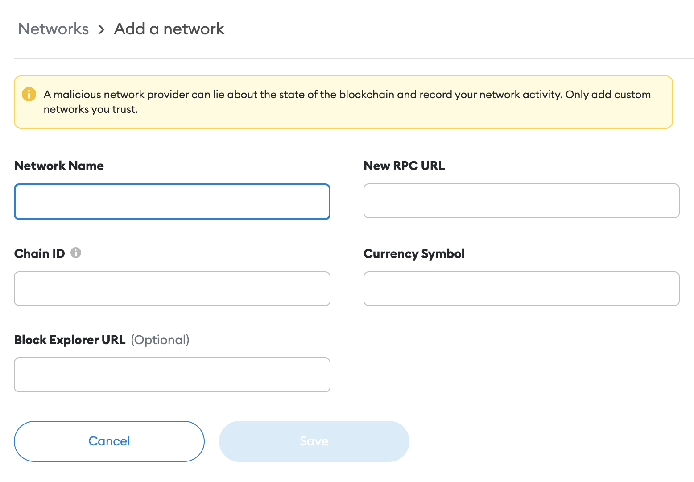

您可以通过访问轻松地将 EOS EVM 网络（主网和测试网）添加到您的 MetaMask
[**链表**](https://chainlist.org/?search=EOS&testnets=true) 并点击 **“连接钱包”** 按钮。

## 手动添加

打开你的 MetaMask 钱包并点击顶部中心的网络：

！[元掩码顶部网络按钮](./images/metamask_top_network_button.png)

点击 `Add network` 在下拉列表的末尾：

！[元掩码顶部网络按钮](./images/metamask_add_network_button.png)

添加以下详细信息：

* `Network Name`: EOS EVM 网络
* `Chain ID`: 17777
* `New RPC URL`: https://api.evm.eosnetwork.com/
* `Currency Symbol`: EOS
* `Block Explorer URL (Optional)`: https://explorer.evm.eosnetwork.com/
* `Token Bridge`: https://bridge.evm.eosnetwork.com/

<详情>
    
如果需要测试网详细信息，请单击此处

* `Network Name`: EOS EVM 网络测试网
* `Chain ID`: 15557
* `New RPC URL`: https://api.testnet.evm.eosnetwork.com/
* `Currency Symbol`: EOS
* `Block Explorer URL (Optional)`: https://explorer.testnet.evm.eosnetwork.com/
* `Token Bridge`: https://bridge.testnet.evm.eosnetwork.com/

</详情>

现在单击保存，您应该会在 MetaMask 下拉列表中看到新网络。
