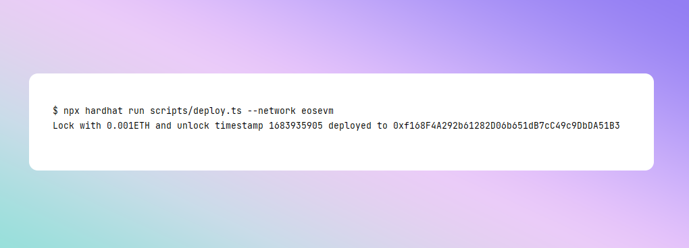

本指南将教您在 EOS EVM 主网和测试网上使用 hardhat 将智能合约部署到 EOS EVM。

## 设置你的 MetaMask

您可以一键将 EOS EVM Testnet 网络添加到您的 MetaMask [**链表**](https://chainlist.org/?search=EOS&testnets=true).

只需选择您要使用的网络，然后单击**连接钱包**按钮。

！[链表](./images/chainlist.png)

您现有的任何以太坊地址都可以在 EOS EVM 上运行，因此您可以使用与以太坊相同的钱包
或任何其他 EVM 兼容链。

## 获取 EOS 代币

如果你在测试网上，你可以使用 [**测试网水龙头**](https://faucet.testnet.evm.eosnetwork.com/).

如果您在主网上，您需要从交易所购买一些 EOS 代币。 EOS之间没有区别
在 EOS 网络上的 EVM 和 EOS 上。它们是相同的标记，可以互换使用。拥有一些 EOS 代币后，您可以使用标准 EOS 转移将它们转移到您的 EOS EVM 地址。
- 将代币发送至： `eosio.evm`
- 设置 `memo` 到您的 EOS EVM 地址

这 `eosio.evm` 然后合约会将您发送的代币转发到您的 EOS EVM 地址。

## 安全帽配置

如果您想建立一个新的安全帽项目，请前往他们的 [快速开始](https://hardhat.org/hardhat-runner/docs/getting-started#quick-start)
指导。


打开你的 `hardhat.config.js` 文件并添加以下配置：


```javascript
const config: HardhatUserConfig = {
    // ...

    networks: {
        eosevm: {
            url: "https://api.evm.eosnetwork.com",
            accounts:[process.env.PRIVATE_KEY],
        },
        eosevm_testnet: {
            url: "https://api.testnet.evm.eosnetwork.com",
            accounts:[process.env.PRIVATE_KEY],
        }
    }
};
```

> 🔑 **私钥**
>
> 请注意，我们正在使用 `process.env.PRIVATE_KEY` 确保我们的私钥没有暴露在我们的代码中。
> 这意味着您需要使用类似 `dotenv` 将密钥注入您的环境，
> 手动将其添加到您的环境中，或者您可以直接将环境变量替换为您的私钥。
>
> 但是，请小心将您的实际密钥放入此文件，因为它可能会提交到公共存储库，
> 你永远不应该与任何人分享你的私钥。

## 部署你的合约

现在您可以将合约部署到 EOS EVM 测试网：

```bash
npx hardhat run scripts/deploy.js --network eosevm

// or for testnet
npx hardhat run scripts/deploy.js --network eosevm_testnet
```

部署后，您将看到新合约的地址，并可以通过粘贴它在浏览器中查看
进入搜索栏。

- [**测试网浏览器**](https://explorer.testnet.evm.eosnetwork.com/)
- [**主网浏览器**](https://explorer.evm.eosnetwork.com/)



## 恭喜！

您已成功将您的第一个智能合约部署到 EOS EVM！ 🎉

如果您已经有一个与您的智能合约交互的前端应用程序，您现在可以将它指向
[EOS EVM 端点](./10_endpoints.md) 它将按预期工作。

请务必访问 [**兼容性**](../30_compatibility/index.md) 部分了解两者之间的差异
EOS EVM 和以太坊，以及如何确保您的 web3 应用程序按预期在 EOS EVM 上运行。
